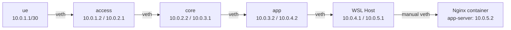
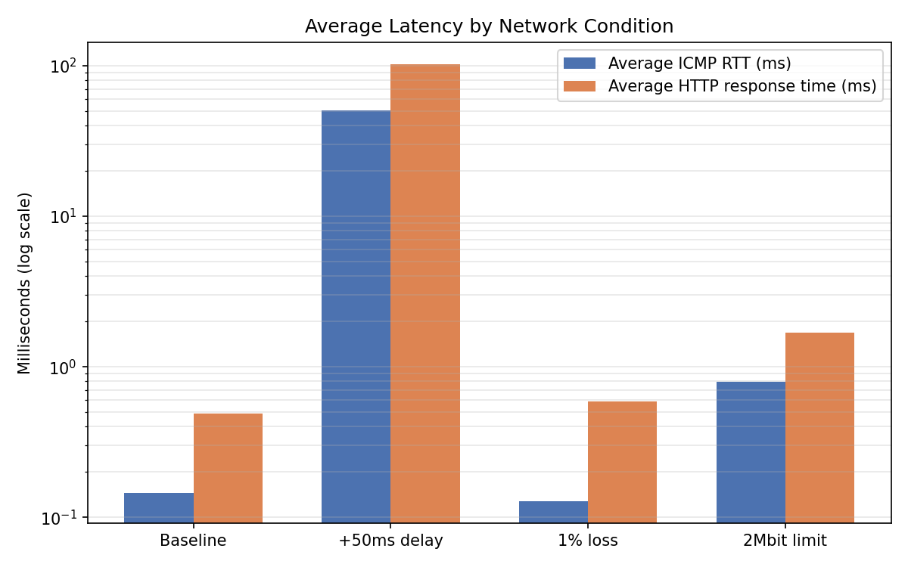
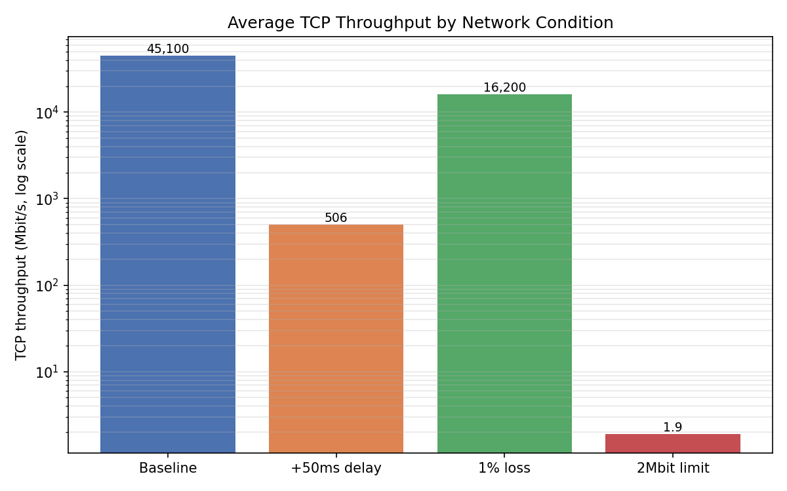
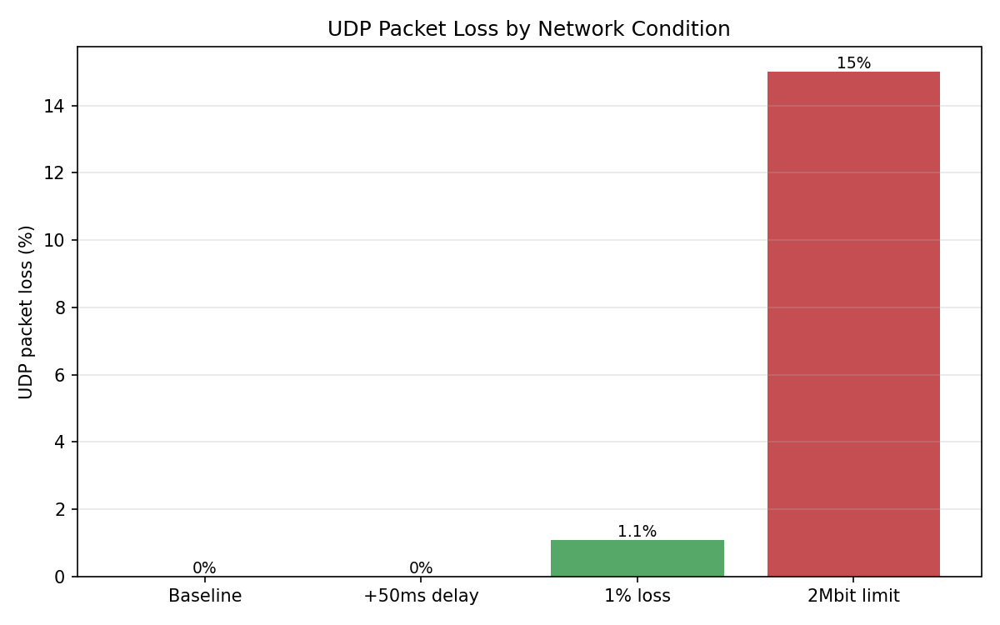

# Project 1 – Network Deployment, Measurement, and Observability
## Technical Report — Scenario A

**Author:** Damien Guffon — Esisar
**Environment:** WSL2 (Ubuntu 24.04.2 LTS), native Docker Engine (not Docker Desktop)

---

## 1. Overview

This project implements **Scenario A**: a simplified software-based telecommunications network built with Linux network namespaces and virtual Ethernet interfaces (veth), hybridized with a containerized application service (Nginx via Docker). The objective is to deploy, verify, observe, and measure a complete communication path, following the **Deploy → Verify → Observe → Measure → Diagnose → Explain** approach required by the assignment.

### Architecture



| Role | Namespace / element | Represents |
|---|---|---|
| UE / Client | `ue` | User equipment |
| Access Network | `access` | Access network |
| Core Network / Gateway | `core` | Network core |
| Data Network (entry point) | `app` | Boundary before the application network |
| Integration boundary | Linux host (root namespace) | Boundary between namespaces and Docker |
| Application Server | `app-server` container (Nginx) | Application service |

**Notable technical choice**: the Nginx container is **not** attached via Docker's default bridge. Under WSL2, this bridge silently blocked routed traffic (see §2.4 — Diagnostics). The container is instead attached through a **manual veth pair** directly between the host and its network namespace — an approach explicitly permitted by the assignment ("*you may use alternative software or technical approaches*").

---

## 2. Step 1 — Network Deployment and End-to-End Operation

### 2.1 IP addressing table

| Namespace | Interface | IP address | Linked to |
|---|---|---|---|
| `ue` | veth-ue | 10.0.1.1/30 | access |
| `access` | veth-acc-in | 10.0.1.2/30 | ue |
| `access` | veth-acc-out | 10.0.2.1/30 | core |
| `core` | veth-core-in | 10.0.2.2/30 | access |
| `core` | veth-core-out | 10.0.3.1/30 | app |
| `app` | veth-app | 10.0.3.2/30 | core |
| `app` | veth-app2 | 10.0.4.2/30 | host |
| Host | veth-host | 10.0.4.1/30 | app |
| Host | veth-host2 | 10.0.5.1/24 | Nginx container |
| `app-server` (container) | veth-container | 10.0.5.2/24 | host |

### 2.2 Routing table (summary)

- `ue`: default route via `access` (10.0.1.2)
- `access`: default route via `core` (10.0.2.2)
- `core`: route to 10.0.1.0/30 via `access` (10.0.2.1); default route via `app` (10.0.3.2)
- `app`: explicit routes to 10.0.1.0/30 and 10.0.2.0/30 via `core` (10.0.3.1); default route via the host (10.0.4.1)
- Host: route to 10.0.0.0/16 via `app` (10.0.4.2); IP forwarding enabled everywhere

### 2.3 Proof of end-to-end operation

```
$ sudo ip netns exec ue ping -c 4 10.0.5.2
64 bytes from 10.0.5.2: icmp_seq=1 ttl=60 time=0.095 ms
...
4 packets transmitted, 4 received, 0% packet loss

$ sudo ip netns exec ue curl http://10.0.5.2
<!DOCTYPE html>...<title>Welcome to nginx!</title>...
```

**TTL analysis**: an ICMP packet starts with an initial TTL of 64. The TTL observed on arrival (`ttl=60`) confirms traversal through **4 routing hops** (`access`, `core`, `app`, host) — consistent with the constructed topology, and an independent numerical proof of the path actually taken.

### 2.4 Diagnostics — non-functional Docker bridge under WSL2

During the first attempt (Nginx container attached via Docker's default bridge), traffic routed from `ue` never reached the container, despite a correct configuration at every level checked:
- Routing and addressing: correct
- `net.ipv4.ip_forward`: enabled everywhere
- iptables rules (`FORWARD`, `DOCKER-USER`): tested and corrected, no effect
- ARP resolution: working (`ip neigh` confirmed a resolved entry)
- `FORWARD` policy fully opened to `ACCEPT`: still zero packets received on the bridge side

Each hypothesis was tested and methodically eliminated. Root cause identified: a limitation specific to the Linux bridge under WSL2's lightweight kernel, which did not correctly relay externally routed traffic. **Adopted solution**: replace the Docker bridge with a direct point-to-point veth pair between the host and the container's network namespace (`docker run --network none`, then manual attachment) — the same reliable technique used for the rest of the topology.

### 2.5 Reconnection after a WSL restart

Network namespaces are **volatile** kernel state: they do not survive a WSL restart. The script [`setup.sh`](setup.sh) automatically rebuilds the entire topology (namespaces, veth pairs, addressing, routing, Nginx container, persistent iptables rules) with a single command.

---

## 3. Step 2 — Traffic Observation and Protocol Behavior

Method: simultaneous `tcpdump` capture at two observation points (`ue` and `app-server`), to prove that a packet observed at the source is indeed received at the destination (and vice versa for the response).

### 3.A ICMP

```
13:14:05.418782 IP 10.0.1.1 > 10.0.5.2: ICMP echo request, id 3252, seq 1, length 64
13:14:05.418948 IP 10.0.1.1 > 10.0.5.2: ICMP echo request, id 3252, seq 1, length 64  (seen at container)
13:14:05.418970 IP 10.0.5.2 > 10.0.1.1: ICMP echo reply,   id 3252, seq 1, length 64
```

- Every `echo request` has a matching `echo reply`, visible at both observation points.
- Propagation time measured between the two observation points: ~166 µs.
- 0% packet loss across all tests.

### 3.B TCP (HTTP via Nginx)

Full sequence observed: `SYN → SYN-ACK → ACK → GET / HTTP/1.1 → ACK → HTTP/1.1 200 OK → ACK → FIN → ACK → FIN → ACK`.

- Addresses/ports: `10.0.1.1:40844` ↔ `10.0.5.2:80`
- No retransmissions in this capture.
- Clean 4-way connection teardown (FIN/ACK on both sides).

### 3.C UDP (iperf3)

```
[  5]   0.00-5.00 sec  2.98 MBytes  5.00 Mbits/sec  0.055 ms  0/2158 (0%)  receiver
```

- Requested throughput = received throughput (5 Mbit/s).
- 0% loss, jitter ~0.055 ms.
- Control packets (`length 4`) followed by the data stream (`length 1448`), traffic essentially unidirectional `ue → app-server`.
- Unlike TCP, no retransmission mechanism is visible: the observed reliability is empirical, not protocol-guaranteed.

### 3.D Application (HTTP)

```
Status: 200, Time: 0.000943s
```

---

## 4. Step 3 — Performance Measurement and Network Degradation

### 4.1 Measurement point

All degradations are applied on interface **`veth-core-out`** in the `core` namespace (the `core → app` link, at the "Core Network/Gateway → Data Network" boundary). Since `tc`/`netem` acts on *egress*, only the `ue → app` direction is affected — the return direction is not.

### 4.2 Baseline (no degradation, 3 repetitions per measurement)

| Metric | Result |
|---|---|
| Average ICMP RTT | ~0.14 ms (0% loss) |
| TCP throughput | ~45 Gbit/s *(see note)* |
| UDP throughput | 5.00 Mbit/s requested = achieved, 0% loss |
| Average HTTP response time | ~0.49 ms |

> **Interpretation note**: ~45 Gbit/s is not a real network capacity figure. A veth is a pair of virtual interfaces — the "traffic" is essentially a kernel memory copy, with no real physical limit. This number reflects the host machine's memory/CPU bandwidth, not a realistic network throughput.

### 4.3 Experiment 1 — 50 ms delay

Command: `tc qdisc add dev veth-core-out root netem delay 50ms`

| Metric | Baseline | +50ms delay |
|---|---|---|
| ICMP RTT | ~0.14 ms | **~50.4 ms** |
| TCP throughput | ~45 Gbit/s | **~506 Mbit/s** |
| TCP retransmissions | 406–6205 | 0–73 |
| UDP throughput | 5.00 Mbit/s | 4.95 Mbit/s (unchanged) |
| HTTP response time | ~0.49 ms | **~102 ms** |

**Interpretation**:
- RTT increases by exactly ~50ms (once), confirming the unidirectional effect of `netem` on egress.
- TCP throughput collapses not from a lack of "capacity" but from the **bandwidth-delay product** effect: the TCP congestion window can only grow at the pace of received acknowledgements, mechanically slowed by a 300× larger RTT.
- HTTP response time increases by **~100ms, not 50ms**: an HTTP request traverses the impacted direction twice (the `SYN` of the TCP handshake, then the `GET` request itself), versus once for a ping.
- UDP, having no windowing or acknowledgment mechanism, is essentially insensitive to a constant delay.

### 4.4 Experiment 2 — 1% packet loss

Command: `tc qdisc add dev veth-core-out root netem loss 1%`

| Metric | Baseline | 1% loss |
|---|---|---|
| ICMP RTT | ~0.14 ms | ~0.13 ms (loss not detected) |
| TCP throughput | ~45 Gbit/s | ~16.2 Gbit/s |
| TCP retransmissions | 406–6205 | **65525–76528** |
| UDP loss (receiver) | 0% | **~1.1%** (matches configured rate) |
| HTTP response time | ~0.49 ms | ~0.59 ms (nearly unchanged) |

**Interpretation**:
- ICMP (10 packets/run) shows no observed loss: at a 1% rate, the expected value over 30 packets is 0.3 — statistically plausible to observe nothing. UDP (2158 datagrams) gives a much more reliable measurement (~1.1%, matching configuration).
- **Pitfall worth noting**: iperf3's UDP *sender* side always reports 0% loss (it cannot see what happens after transmission) — only the *receiver* side reveals actual loss.
- TCP throughput remains high despite tens of thousands of retransmissions: on a link with near-zero RTT, each retransmission costs very little time. The impact of loss on TCP is amplified by RTT, not just by the loss rate itself.

### 4.5 Experiment 3 (bonus) — 2 Mbit/s rate limiting

Command: `tc qdisc add dev veth-core-out root netem rate 2mbit`

| Metric | Baseline | 2 Mbit limit |
|---|---|---|
| ICMP RTT | ~0.14 ms | ~0.79 ms |
| TCP throughput (sender / receiver) | ~45 Gbit/s | **7–8 Mbit/s (sender) / ~1.9 Mbit/s (receiver)** |
| TCP retransmissions | 406–6205 | 0 |
| UDP loss (receiver) | 0% | **~15%** (concentrated at the end of the test) |
| HTTP response time | ~0.49 ms | ~1.69 ms |

**Interpretation**:
- **Sender/receiver discrepancy in TCP**: the sender reports 7–8 Mbit/s (the rate at which it pushes data into its local send buffer), well above the configured limit. The actually delivered throughput (receiver, ~1.9 Mbit/s) matches the configured limit. Always trust the receiver side for real throughput when a downstream bottleneck is present.
- **Bufferbloat observed**: tests run for 7.8 to 9.4s instead of the requested 5s — the time it takes for the accumulated queue to drain after sending stops.
- **Loss from buffer saturation, not randomness**: UDP loss (~15% overall) is concentrated in the last two intervals (28% then 61%), a signature typical of a buffer overflowing once its capacity is reached — the opposite of the uniform, random loss seen in the 1% experiment.
- Nearly identical results (down to the exact packet count) across all 3 repetitions (319/2157 each time): a signature of a deterministic phenomenon (fixed capacity) rather than a probabilistic one.

### 4.6 Visual comparison







---

## 5. Conclusion

Scenario A was successfully deployed, verified, observed, and measured:
- **Step 1**: a complete communication path `ue → access → core → app → host → Nginx container` operational, with technical evidence (TTL, ping, curl) and a concrete diagnostic example (non-functional Docker bridge under WSL2, worked around with a manual veth).
- **Step 2**: all 4 required traffic categories (ICMP, TCP, UDP, Application) observed and documented at two points along the chain.
- **Step 3**: a baseline established over 3 repetitions, followed by 3 controlled degradations (delay, random loss, rate limiting — beyond the minimum of 2 required), each revealing a distinct mechanism and signature.

The full environment is reproducible with two commands via `setup.sh` and `testStep3.sh`, provided at the root of this repository.

---

## Appendix — Reproducing the environment

```bash
chmod +x setup.sh testStep3.sh

# Rebuilds the entire topology (namespaces, veth, Nginx container, iptables)
./setup.sh

# Runs the performance measurement suite (baseline by default, or with a condition label)
./testStep3.sh "Baseline / no impairment"
```
