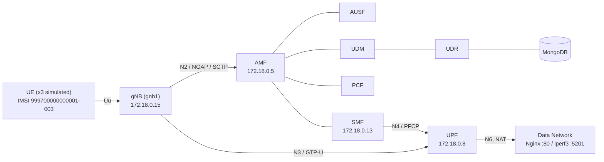
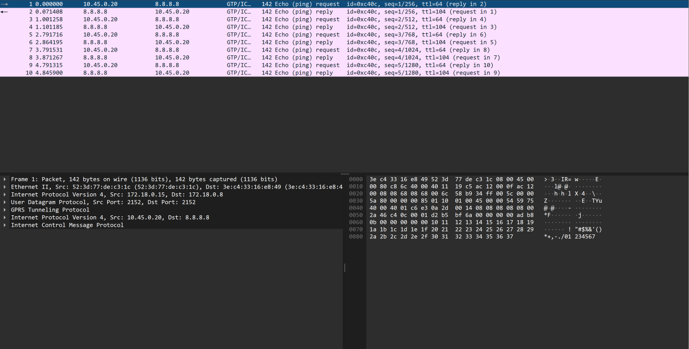
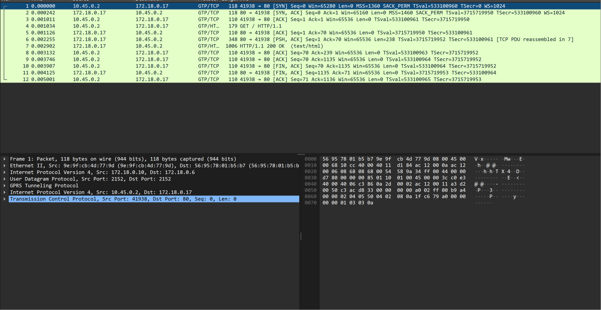

# Project 1 – Network Deployment, Measurement, and Observability
## Technical Report — Scenario B (Advanced 5G SA Network)

**Author:** Damien Guffon — Esisar
**Environment:** WSL2 (Ubuntu 24.04.2 LTS), Docker Compose, base deployment from [Gradiant/openverso-images](https://github.com/Gradiant/openverso-images)

**Status:** Step 1 complete. Step 2 complete (registration sequence, N2/NGAP/SCTP, N3/GTP-U, N4/PFCP, N6 TCP/UDP and service-based architecture, all with log and packet evidence). Step 3 not started.

---

## 1. Overview

Scenario B deploys a full 5G Standalone (SA) core and RAN using Open5GS and UERANSIM in Docker, following the reference path:

```
UE → gNB → N3/GTP-U → UPF → N6 → Data Network → Application Service
```

with the parallel control-plane path:

```
gNB → N2/NGAP/SCTP → AMF → SMF → N4/PFCP → UPF
```

**PLMN / identifiers:** MCC `999`, MNC `70`, TAC `1`, SST `1`, SD `0xffffff`

**Deployment choice:** unlike the course reference diagram (which uses separate subnets per domain, e.g. `10.20.x.x`), this deployment places the gNB, UEs, all 13 core network functions, and the application server on a **single Docker bridge network** (`open5gs-and-ueransim_default`, `172.18.0.0/16`). The application services (Nginx for HTTP/TCP, iperf3 for UDP measurement) are defined in `app.yaml` and attached to the same bridge, where they play the role of the N6 data network. This is a deliberate simplification inherited from the Gradiant reference base and is explicitly permitted by the assignment ("*you may use alternative software or technical approaches*"). It does not affect the validity of the 5G procedures themselves — registration, authentication, and PDU session establishment all occur exactly as they would with segmented subnets.

### Architecture



---

## 2. Step 1 — Network Deployment and End-to-End Operation

### 2.1 Network functions deployed

Via `ngc.yaml` (13 containers): AMF, AUSF, BSF, MongoDB, NRF, NSSF, PCF, SCP, SMF, UDM, UDR, UPF, WebUI.
Via `gnb1.yaml`: gNB (`gnb1`) + 3 simulated UEs (`ues1`).
Via `app.yaml`: Nginx (HTTP application server) and iperf3 (UDP/TCP measurement server).

Container IP addresses on the bridge are assigned dynamically and change across restarts (for example, after a host reboot the gNB moved from `172.18.0.15` to `172.18.0.10` and the UPF from `172.18.0.8` to `172.18.0.6`). Packet captures are therefore filtered by port (2152, 8805, 38412, 5201) rather than by address.

### 2.2 Interface table

| Interface | Role | Protocol | Between |
|---|---|---|---|
| N2 | RAN control signaling | NGAP / SCTP | gNB ↔ AMF |
| N3 | User-plane transport | GTP-U / UDP (port 2152) | gNB ↔ UPF |
| N4 | Session control | PFCP / UDP (port 8805) | SMF ↔ UPF |
| N6 | Data network connectivity | IP (NAT) | UPF ↔ Internet / App |
| SBI | Service bus | HTTP/2 | AMF/SMF/AUSF/UDM/UDR/PCF/NRF/SCP ↔ each other |

**UE IP pool:** `10.45.0.0/16`, gateway `10.45.0.1` (defined in `config/smf.yaml`)

### 2.3 Proof of end-to-end operation

```
# UE side: PDU session established, TUN interface up
uesimtun0: inet 10.45.0.2/32 scope global uesimtun0

# Connectivity to the internet through the tunnel (N3 -> UPF -> N6)
$ ping -I uesimtun0 -c 4 8.8.8.8
4 packets transmitted, 4 received, 0% packet loss
rtt min/avg/max/mdev = 58.796/70.422/91.143/12.432 ms

# Connectivity to the application server through the tunnel
$ curl --interface uesimtun0 http://nginx
HTTP 200
```

UERANSIM does not replace the UE container's default route: only traffic explicitly bound to `uesimtun0` (or to the PDU session address) enters the 5G tunnel. Every user-plane test in this report is therefore bound to `uesimtun0`, and its path is confirmed with a GTP-U capture on N3 (see §3.5).

> **Correction.** An earlier version of this report presented a plain `curl` (without `--interface`) as proof of the 5G path. That request left through the container's `eth0` and reached Nginx directly over the Docker bridge, bypassing the gNB and UPF. The A/B test in §3.5 demonstrates the difference with packet evidence.

### 2.4 Diagnosed incident — service dependency without restart policy

After ~3 days of WSL inactivity, `udr` and `pcf` were found in a continuous restart loop.

- **Symptom:** `docker compose ps` showed `udr`/`pcf` as `Restarting (1)`.
- **Evidence:** logs showed `Failed to connect to server [mongodb://mongo/open5gs]` repeating every ~60s.
- **Root cause:** in `ngc.yaml`, `mongo` was the only service without a `restart: on-failure` policy. After the WSL restart, every other service recovered automatically; `mongo` stayed stopped, so every service depending on it (`udr`, `pcf`) failed to initialize in a loop. `gnb1`/`ues1` had the same gap and had also stopped.
- **Fix:** `docker start` on `mongo`, then on `gnb1`/`ues1`; `restart: on-failure` added to all three in `ngc.yaml` / `gnb1.yaml` to prevent recurrence.
- **Verification:** subscriber data in MongoDB confirmed intact after recovery; full registration cycle re-confirmed (new `uesimtun0` IP assigned, ping to 8.8.8.8 successful).

---

## 3. Step 2 — Traffic Observation and 5G Protocol Behavior

Method: live logs from `amf`, `ausf`, `udm`, `udr`, `smf`, `upf`, `gnb1`, `ues1` captured during a triggered registration cycle (`docker restart` on the UE container), paired with a `tcpdump` packet capture on the Docker bridge interface filtered per-interface (N2/N4 together, N3 separately with a simultaneous ping to generate user-plane traffic).

### 3.1 Registration sequence (UE `imsi-999700000000002` → `uesimtun0`)

| Step | From → To | Interface | Log evidence |
|---|---|---|---|
| PLMN/cell selection | UE | — | `Selected plmn[999/70]`, `Selected cell... tac[1]` |
| RRC Setup | UE → gNB | Uu (simulated) | UE: `Sending RRC Setup Request` / gNB: `RRC Setup for UE[2]` |
| Registration Request | gNB → AMF | **N2/NGAP/SCTP** | AMF: `InitialUEMessage`, `Unknown UE by SUCI` |
| AUSF selection | AMF → AUSF | SBI | AMF: `Setup NF Instance [type:AUSF]` |
| Authentication Request | AMF → UE (via N2) | N2 | UE: `Authentication Request received` |
| Security Mode Command | AMF → UE (via N2) | N2 | UE: `Security Mode Command received` |
| Subscriber data fetch | AMF → UDM → UDR → MongoDB | SBI | UDR: `MongoDB URI: mongodb://mongo/open5gs` |
| Policy association | AMF → PCF | SBI | AMF: `Setup NF EndPoint... npcf-handler` |
| Registration Accept/Complete | AMF ↔ UE | N2 | UE: `Initial Registration is successful` |
| PDU Session Establishment Request | UE → AMF → SMF | N2 then SBI | AMF: `/nsmf-pdusession/.../modify` |
| PDU Session Establishment Accept | SMF → AMF → UE | N2 | UE: `PDU Session establishment is successful PSI[1]` |
| Tunnel up | — | — | UE: `TUN interface[uesimtun0, 10.45.0.2] is up` |
| N3 resource setup | gNB ↔ UPF | N3 | gNB: `PDU session resource(s) setup for UE[2] count[1]` |

Full raw log: [`evidence/registration-sequence-full.log`](evidence/registration-sequence-full.log)

### 3.2 N2 / NGAP / SCTP analysis

Packet capture ([`evidence/n2-n3-n4-summary.txt`](evidence/n2-n3-n4-summary.txt)) shows the SCTP association between gNB (`172.18.0.15:38559`) and AMF (`172.18.0.5:38412`) already alive and periodically probed via `[HB REQ]/[HB ACK]` heartbeats **before** any UE activity — proof that N2 is a persistent control-plane association, independent of individual UE sessions. Actual `[DATA]` chunks begin at the exact timestamp the AMF log records `InitialUEMessage`, confirming that the NGAP Registration Request is carried inside this SCTP association. Multiple Stream IDs (`SID: 1, 2, 3, 7, 8, 9...`) are used concurrently — SCTP's multi-streaming, which lets the 3 parallel UE registrations proceed without head-of-line blocking (the reason NGAP uses SCTP rather than TCP).

### 3.3 N4 / PFCP analysis

For `imsi-999700000000003` (assigned `10.45.0.20`):

| Level | Evidence |
|---|---|
| SMF log | `UE SUPI[imsi-...003] DNN[internet] IPv4[10.45.0.20]` |
| UPF log | `UE F-SEID[UP:0x99e CP:0xafd]... IPv4[10.45.0.20]` (same timestamp, same IP) |
| Packet | `172.18.0.13.8805 > 172.18.0.8.8805: UDP, length 596` (PFCP Session Establishment Request) then `172.18.0.8.8805 > 172.18.0.13.8805: UDP, length 116` (Response), followed by a smaller Modification exchange (75/21 bytes) |

Three such exchanges appear in the capture, one per registered UE. This confirms N4/PFCP does not carry application data — it only configures the UPF's forwarding/session state, which is then used to actually forward N3 user-plane traffic.

### 3.4 N3 / GTP-U analysis

A dedicated capture was taken on UDP port 2152 while simultaneously pinging `8.8.8.8` from inside the UE (`ping -I uesimtun0`). Result: 10 packets (5 request + 5 reply), perfectly matching the 5 ICMP exchanges — text summary in [`evidence/n3-summary.txt`](evidence/n3-summary.txt).

Opened in Wireshark, a single packet decodes as:



```
Ethernet
 └─ IP        172.18.0.15 (gNB) → 172.18.0.8 (UPF)      ← outer envelope (N3 transport)
     └─ UDP   port 2152
         └─ GTP-U (GPRS Tunneling Protocol)
             └─ IP    10.45.0.20 (UE) → 8.8.8.8          ← inner packet, the UE's own traffic
                 └─ ICMP
```

This is the direct evidence requested by the assignment for *"why the inner application packet can be carried inside GTP-U"*: on the transport network between gNB and UPF, only generic UDP traffic between two Docker hosts is visible — the UE's real source/destination IP is completely hidden unless the GTP-U layer is decoded. Wireshark also auto-correlates request/reply pairs (`reply in 2`) and shows differing TTLs (64 outbound from the UE, 104 on the reply from the public internet), consistent with every other RTT measurement taken so far.

### 3.5 N6 — TCP application traffic (HTTP via Nginx)

The same HTTP request was issued twice from the UE container, with a GTP-U capture on N3 (UDP port 2152) running during each request:

| Test | Command | HTTP result | Time | GTP-U packets on N3 |
|---|---|---|---|---|
| A — 5G path | `curl --interface uesimtun0 http://nginx` | 200 | 5.7 ms | **12** |
| B — Docker shortcut | `curl http://nginx` | 200 | 1.0 ms | **0** |

Both requests succeed, but only test A crosses the 5G core. Test B leaves through `eth0` and reaches Nginx directly on the Docker bridge, without touching the gNB or the UPF. This is the situation the assignment warns about: a successful application response does not prove which path was used; only packet evidence on N3 does. The extra ~4.7 ms of test A is the cost of the tunnel (GTP-U encapsulation in the simulated gNB, decapsulation and forwarding in the UPF).

Decoded in Wireshark, the 12 GTP-U packets of test A contain one complete TCP connection between `10.45.0.2:41938` (UE) and `172.18.0.17:80` (Nginx): three-way handshake, `GET / HTTP/1.1`, `HTTP/1.1 200 OK (text/html)`, and a clean FIN/ACK teardown, all within 5 ms.



The SYN from the UE advertises **MSS 1360**, while Nginx advertises **MSS 1460**. `uesimtun0` has an MTU of 1400 (set in `smf.yaml`), which leaves room for the outer IP, UDP and GTP-U headers so that every encapsulated packet still fits in a 1500-byte Ethernet frame without fragmentation. TCP uses the smaller of the two values.

### 3.6 N6 — UDP traffic (iperf3)

`iperf3 -c iperf3 -B 10.45.0.2 -u -b 5M -t 5` was run from the UE, bound to the PDU session address, with a capture on both N3 (port 2152) and N6 (port 5201). Full output: [`evidence/n6-udp-iperf3.txt`](evidence/n6-udp-iperf3.txt).

| Metric | Value |
|---|---|
| Offered / received throughput | 5.00 / 5.00 Mbit/s |
| Loss | 0 / 2318 datagrams |
| Jitter (receiver) | 0.193 ms |
| Packets on N3 (GTP-U encapsulated) | 2349 |
| Packets on N6 (native, port 5201) | 2349 |

- **One-to-one N3/N6 correspondence.** Every packet entering the tunnel exits on N6 and vice versa (2349 on both sides): the UPF decapsulates and forwards all traffic without loss.
- **NAT on N6.** The UE reports its source as `10.45.0.2`, but on N6 the iperf3 server sees `172.18.0.6`, the UPF (source port 46232 is preserved). The application server never sees the UE's real address; only the inner header inside the N3 tunnel carries it. This is the default behaviour of the Gradiant UPF image (`ENABLE_NAT` is left commented out in `ngc.yaml`, so NAT is active).
- **MTU effect on datagram count.** iperf3 sizes its UDP datagrams from the MSS of its control connection: 1348 bytes here, versus 1448 bytes in Scenario A. For the same 5 Mbit/s over 5 s this gives 2318 datagrams here and 2158 in Scenario A, and the arithmetic matches both cases (3.125 MB / 1348 B and 3.125 MB / 1448 B).

### 3.7 Service-based architecture (NRF, SCP and inter-NF services)

Evidence: NRF and SCP logs since container creation ([`evidence/sba-nrf-scp.log`](evidence/sba-nrf-scp.log)) and a clean, time-sorted excerpt of the 6 October startup ([`evidence/sba-startup-2026-10-06.txt`](evidence/sba-startup-2026-10-06.txt)). Times below are container time (UTC).

**NRF services.** At startup the NRF (`172.18.0.7:7777`, HTTP/2) exposes two services: `nnrf-nfm` (NF management: registration, heartbeat, subscriptions) and `nnrf-disc` (NF discovery).

**Registration and heartbeat.** At 10:33:22, six NF instances register with the NRF within 130 ms, each with a 10 s heartbeat (`NF registered [Heartbeat:10s]`). Six is consistent with AMF, SMF, AUSF, UDM, BSF and NSSF; the UPF does not appear because it has no SBI interface in Open5GS and is controlled over N4/PFCP instead. Together with the SCP (10:33:32) and UDR/PCF (10:35:00), this gives 9 registrations on that day, matching the NRF log.

**Subscriptions and notifications.** Each NF also creates subscriptions at the NRF (`Subscription created until ... [validity:86400]`), so that it is notified when other NF profiles appear or change. The SCP log shows these notifications arriving: `(NRF-notify) NF registered` followed by `NF Profile updated [type:UDR]` and `[type:PCF]`.

**Indirect communication through the SCP.** `smf.yaml` points the SBI client at the SCP only (`client: scp: uri: http://scp:7777`, NRF commented out), i.e. communication is delegated to the SCP. The SCP log confirms that discovery requests are resolved by the SCP on behalf of consumers: `(NF discover) No NF-Instance [nudr-dr:UDM]` is the SCP failing to find a UDR (`nudr-dr` data-repository service) for a request originating from the UDM.

**Observed startup dependency chain (abnormal but self-healing condition).**

| Time (UTC) | Event | Evidence |
|---|---|---|
| 10:33:21.842 | SCP cannot reach NRF yet (NRF finishes initialising 3 ms later) | `Failed to connect to nrf port 7777: Connection refused` |
| 10:33:22 | AMF, SMF, AUSF, UDM, BSF, NSSF register with NRF | `NF registered [Heartbeat:10s]` |
| 10:33:32.844 | SCP retries and registers | `Retry registration with NRF` → `NF registered` |
| 10:34:42 – 10:34:52 | UDM requests to the UDR data service fail: no UDR registered yet | `(NF discover) No NF-Instance [nudr-dr:UDM]` (×6) |
| 10:35:00.276 | UDR registers; NRF notifies the SCP | `(NRF-notify) NF Profile updated [type:UDR]` |
| 10:35:00.284 | PCF registers | `(NRF-notify) NF Profile updated [type:PCF]` |

UDR and PCF are the only functions that depend on MongoDB, and they registered about 98 s after the others: they restart in a loop (`restart: on-failure`) until MongoDB accepts connections. Meanwhile any procedure that needs subscriber data (UDM → UDR) fails at discovery. As soon as the UDR registers, the NRF notification mechanism makes it visible to the SCP and the chain recovers without manual intervention. This is the same dependency that caused the incident in §2.4, which then did not recover on its own because MongoDB had no restart policy.

**Heartbeat-based liveness.** On 2 October at 13:25 UTC the NRF logged `No heartbeat` followed by `NF de-registered` for two NF instances, while new instances registered under new IDs. This coincides with the forced `docker restart` of `udr` and `pcf` during the incident in §2.4: the killed instances stopped sending heartbeats without de-registering, and the NRF purged them once their 10 s heartbeat expired.

## 4. Step 3 — Performance Measurement, Network Degradation, and Data-Driven Analysis

**Not started.** Will require: a quantitative baseline over the full UE→gNB→N3→UPF→N6→App path (≥3 repetitions per metric), controlled degradation experiments (delay, loss, rate limiting, applied at different points), Prometheus + Grafana for time-series/operational telemetry, and a Python/pandas/matplotlib-based analysis — all explicitly required for Scenario B but not for Scenario A.

---

## Appendix — Redeploying this environment

```bash
docker compose -f ngc.yaml up -d
./register_subscriber.sh
docker compose -f gnb1.yaml up -d
docker compose -f app.yaml up -d
```

Verify end-to-end operation (always bind user-plane tests to `uesimtun0`):
```bash
docker compose -f gnb1.yaml exec ues1 ip addr show
docker compose -f gnb1.yaml exec ues1 ping -I uesimtun0 -c 4 8.8.8.8
docker compose -f gnb1.yaml exec ues1 curl --interface uesimtun0 http://nginx
```
