# Project 1 – Network Deployment, Measurement, and Observability
## Technical Report — Scenario B (Advanced 5G SA Network)

**Author:** Damien Guffon — Esisar
**Environment:** WSL2 (Ubuntu 24.04.2 LTS), Docker Compose, base deployment from [Gradiant/openverso-images](https://github.com/Gradiant/openverso-images)

**Status:** Steps 1, 2 and 3 complete.

**Contents:** [1. Overview](#1-overview) · [2. Step 1 — Deployment](#2-step-1--network-deployment-and-end-to-end-operation) · [3. Step 2 — Traffic observation](#3-step-2--traffic-observation-and-5g-protocol-behavior) · [4. Step 3 — Measurement and degradation](#4-step-3--performance-measurement-network-degradation-and-data-driven-analysis) · [5. Diagnosed failures](#5-diagnosed-failures-evidence-chains) · [6. Observation methods](#6-observation-methods-purpose-and-limitations) · [7. Limitations](#7-known-limitations) · [8. Conclusion](#8-conclusion)

---

## 1. Overview

Scenario B deploys a full 5G Standalone (SA) core and RAN using Open5GS and UERANSIM in Docker, following the reference path:

```
UE → gNB → N3/GTP-U → UPF → N6 → Data Network → Application Service
```

with the parallel control-plane path:

```
gNB → N2/NGAP/SCTP → AMF → SMF → N4/PFCP → UPF
```

**PLMN / identifiers:** MCC `999`, MNC `70`, TAC `1`, SST `1`, SD `0xffffff`

**Deployment choice:** unlike the course reference diagram (which uses separate subnets per domain, e.g. `10.20.x.x`), this deployment places the gNB, UEs, all 13 core network functions, and the application server on a **single Docker bridge network** (`open5gs-and-ueransim_default`, `172.18.0.0/16`). The application services (Nginx for HTTP/TCP, iperf3 for UDP measurement) are defined in `app.yaml` and attached to the same bridge, where they play the role of the N6 data network. This is a deliberate simplification inherited from the Gradiant reference base and is explicitly permitted by the assignment ("*you may use alternative software or technical approaches*"). It does not affect the validity of the 5G procedures themselves — registration, authentication, and PDU session establishment all occur exactly as they would with segmented subnets.

Operational observation runs in parallel and never carries user-plane traffic: Open5GS metrics, measurement results and host metrics are collected by **Prometheus** and visualised in **Grafana** (`monitoring.yaml`, §4.11).

### Architecture

IP addresses in the diagram are those of the Step 2 captures; they change across restarts (§2.1).

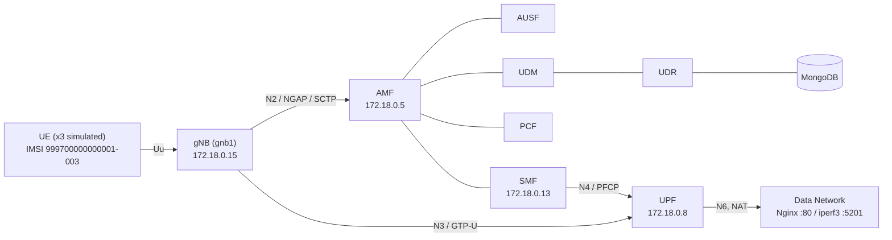

---

## 2. Step 1 — Network Deployment and End-to-End Operation

### 2.1 Network functions deployed

Via `ngc.yaml` (13 containers): AMF, AUSF, BSF, MongoDB, NRF, NSSF, PCF, SCP, SMF, UDM, UDR, UPF, WebUI.
Via `gnb1.yaml`: gNB (`gnb1`) + 3 simulated UEs (`ues1`).
Via `app.yaml`: Nginx (HTTP application server) and iperf3 (UDP/TCP measurement server).

Container IP addresses on the bridge are assigned dynamically and change across restarts (for example, after a host reboot the gNB moved from `172.18.0.15` to `172.18.0.10` and the UPF from `172.18.0.8` to `172.18.0.6`). Packet captures are therefore filtered by port (2152, 8805, 38412, 5201) rather than by address.

### 2.2 Interface table

| Interface | Role | Protocol | Between |
|---|---|---|---|
| N2 | RAN control signaling | NGAP / SCTP | gNB ↔ AMF |
| N3 | User-plane transport | GTP-U / UDP (port 2152) | gNB ↔ UPF |
| N4 | Session control | PFCP / UDP (port 8805) | SMF ↔ UPF |
| N6 | Data network connectivity | IP (NAT) | UPF ↔ Internet / App |
| SBI | Service bus | HTTP/2 | AMF/SMF/AUSF/UDM/UDR/PCF/NRF/SCP ↔ each other |

**UE IP pool:** `10.45.0.0/16`, gateway `10.45.0.1` (defined in `config/smf.yaml`)

### 2.3 Proof of end-to-end operation

```
# UE side: PDU session established, TUN interface up
uesimtun0: inet 10.45.0.2/32 scope global uesimtun0

# Connectivity to the internet through the tunnel (N3 -> UPF -> N6)
$ ping -I uesimtun0 -c 4 8.8.8.8
4 packets transmitted, 4 received, 0% packet loss
rtt min/avg/max/mdev = 58.796/70.422/91.143/12.432 ms

# Connectivity to the application server through the tunnel
$ curl --interface uesimtun0 http://nginx
HTTP 200
```

UERANSIM does not replace the UE container's default route: only traffic explicitly bound to `uesimtun0` (or to the PDU session address) enters the 5G tunnel. Every user-plane test in this report is therefore bound to `uesimtun0`, and its path is confirmed with a GTP-U capture on N3 (see §3.5).

> **Correction.** An earlier version of this report presented a plain `curl` (without `--interface`) as proof of the 5G path. That request left through the container's `eth0` and reached Nginx directly over the Docker bridge, bypassing the gNB and UPF. The A/B test in §3.5 demonstrates the difference with packet evidence.

### 2.4 Diagnosed incident — service dependency without restart policy

After ~3 days of WSL inactivity, `udr` and `pcf` were found in a continuous restart loop.

- **Symptom:** `docker compose ps` showed `udr`/`pcf` as `Restarting (1)`.
- **Evidence:** logs showed `Failed to connect to server [mongodb://mongo/open5gs]` repeating every ~60s.
- **Root cause:** in `ngc.yaml`, `mongo` was the only service without a `restart: on-failure` policy. After the WSL restart, every other service recovered automatically; `mongo` stayed stopped, so every service depending on it (`udr`, `pcf`) failed to initialize in a loop. `gnb1`/`ues1` had the same gap and had also stopped.
- **Fix:** `docker start` on `mongo`, then on `gnb1`/`ues1`; `restart: on-failure` added to all three in `ngc.yaml` / `gnb1.yaml` to prevent recurrence.
- **Verification:** subscriber data in MongoDB confirmed intact after recovery; full registration cycle re-confirmed (new `uesimtun0` IP assigned, ping to 8.8.8.8 successful).

---

## 3. Step 2 — Traffic Observation and 5G Protocol Behavior

Method: live logs from `amf`, `ausf`, `udm`, `udr`, `smf`, `upf`, `gnb1`, `ues1` captured during a triggered registration cycle (`docker restart` on the UE container), paired with a `tcpdump` packet capture on the Docker bridge interface filtered per-interface (N2/N4 together, N3 separately with a simultaneous ping to generate user-plane traffic).

### 3.0 Observation points

All containers share one Docker bridge, so every inter-container interface can be observed from the host on the bridge (`br-<network id>`) and separated by port. Container IP addresses change across restarts, so filters use ports.

| Point | Interface | Where it is observed | Capture filter / source | What is visible |
|---|---|---|---|---|
| P1 | UE / gNB side | inside `ues1`: `uesimtun0` (PDU session) ; UE and gNB logs | `ping -I uesimtun0`, UERANSIM logs | the UE's own IP packets before encapsulation; RRC/NAS procedures (the UERANSIM radio link itself is a simulated UDP link, not a 5G radio) |
| P2 | N2 (gNB ↔ AMF) | Docker bridge | `sctp` (AMF port 38412) | NGAP inside SCTP, heartbeats, multi-streaming |
| P3 | N3 (gNB ↔ UPF) | Docker bridge | `udp port 2152` | outer IP → UDP → GTP-U → inner UE IP packet |
| P4 | N4 (SMF ↔ UPF) | Docker bridge | `udp port 8805` | PFCP session establishment / modification |
| P5 | N6 (UPF ↔ data network) | Docker bridge | `tcp port 80 or port 5201` (traffic between the UPF and Nginx/iperf3) | plain IP, no GTP-U, source NAT-ed to the UPF address |
| P6 | Application service | `nginx` container (port 80) | HTTP via `curl --interface uesimtun0` | HTTP status, response time, connection time |
| P7 | Performance service | `iperf3` container (port 5201) | `iperf3 -B <UE IP>` | TCP/UDP throughput, loss, jitter, retransmissions |

### 3.1 Registration sequence (UE `imsi-999700000000002` → `uesimtun0`)

| Step | From → To | Interface | Log evidence |
|---|---|---|---|
| PLMN/cell selection | UE | — | `Selected plmn[999/70]`, `Selected cell... tac[1]` |
| RRC Setup | UE → gNB | Uu (simulated) | UE: `Sending RRC Setup Request` / gNB: `RRC Setup for UE[2]` |
| Registration Request | gNB → AMF | **N2/NGAP/SCTP** | AMF: `InitialUEMessage`, `Unknown UE by SUCI` |
| AUSF selection | AMF → AUSF | SBI | AMF: `Setup NF Instance [type:AUSF]` |
| Authentication Request | AMF → UE (via N2) | N2 | UE: `Authentication Request received` |
| Security Mode Command | AMF → UE (via N2) | N2 | UE: `Security Mode Command received` |
| Subscriber data fetch | AMF → UDM → UDR → MongoDB | SBI | UDR: `MongoDB URI: mongodb://mongo/open5gs` |
| Policy association | AMF → PCF | SBI | AMF: `Setup NF EndPoint... npcf-handler` |
| Registration Accept/Complete | AMF ↔ UE | N2 | UE: `Initial Registration is successful` |
| PDU Session Establishment Request | UE → AMF → SMF | N2 then SBI | AMF: `/nsmf-pdusession/.../modify` |
| PDU Session Establishment Accept | SMF → AMF → UE | N2 | UE: `PDU Session establishment is successful PSI[1]` |
| Tunnel up | — | — | UE: `TUN interface[uesimtun0, 10.45.0.2] is up` |
| N3 resource setup | gNB ↔ UPF | N3 | gNB: `PDU session resource(s) setup for UE[2] count[1]` |

Full raw log: [`evidence/registration-sequence-full.log`](evidence/registration-sequence-full.log)

### 3.2 N2 / NGAP / SCTP analysis

Packet capture ([`evidence/n2-n3-n4-summary.txt`](evidence/n2-n3-n4-summary.txt)) shows the SCTP association between gNB (`172.18.0.15:38559`) and AMF (`172.18.0.5:38412`) already alive and periodically probed via `[HB REQ]/[HB ACK]` heartbeats **before** any UE activity — proof that N2 is a persistent control-plane association, independent of individual UE sessions. Actual `[DATA]` chunks begin at the exact timestamp the AMF log records `InitialUEMessage`, confirming that the NGAP Registration Request is carried inside this SCTP association. Multiple Stream IDs (`SID: 1, 2, 3, 7, 8, 9...`) are used concurrently — SCTP's multi-streaming, which lets the 3 parallel UE registrations proceed without head-of-line blocking (the reason NGAP uses SCTP rather than TCP).

### 3.3 N4 / PFCP analysis

For `imsi-999700000000003` (assigned `10.45.0.20`):

| Level | Evidence |
|---|---|
| SMF log | `UE SUPI[imsi-...003] DNN[internet] IPv4[10.45.0.20]` |
| UPF log | `UE F-SEID[UP:0x99e CP:0xafd]... IPv4[10.45.0.20]` (same timestamp, same IP) |
| Packet | `172.18.0.13.8805 > 172.18.0.8.8805: UDP, length 596` (PFCP Session Establishment Request) then `172.18.0.8.8805 > 172.18.0.13.8805: UDP, length 116` (Response), followed by a smaller Modification exchange (75/21 bytes) |

Three such exchanges appear in the capture, one per registered UE. This confirms N4/PFCP does not carry application data — it only configures the UPF's forwarding/session state, which is then used to actually forward N3 user-plane traffic.

### 3.4 N3 / GTP-U analysis

A dedicated capture was taken on UDP port 2152 while simultaneously pinging `8.8.8.8` from inside the UE (`ping -I uesimtun0`). Result: 10 packets (5 request + 5 reply), perfectly matching the 5 ICMP exchanges — text summary in [`evidence/n3-summary.txt`](evidence/n3-summary.txt).

Opened in Wireshark, a single packet decodes as:


```
Ethernet
 └─ IP        172.18.0.15 (gNB) → 172.18.0.8 (UPF)      ← outer envelope (N3 transport)
     └─ UDP   port 2152
         └─ GTP-U (GPRS Tunneling Protocol)
             └─ IP    10.45.0.20 (UE) → 8.8.8.8          ← inner packet, the UE's own traffic
                 └─ ICMP
```

This is the direct evidence requested by the assignment for *"why the inner application packet can be carried inside GTP-U"*: on the transport network between gNB and UPF, only generic UDP traffic between two Docker hosts is visible — the UE's real source/destination IP is completely hidden unless the GTP-U layer is decoded. Wireshark also auto-correlates request/reply pairs (`reply in 2`) and shows differing TTLs (64 outbound from the UE, 104 on the reply from the public internet), consistent with every other RTT measurement taken so far.

### 3.5 N6 — TCP application traffic (HTTP via Nginx)

The same HTTP request was issued twice from the UE container, with a GTP-U capture on N3 (UDP port 2152) running during each request:

| Test | Command | HTTP result | Time | GTP-U packets on N3 |
|---|---|---|---|---|
| A — 5G path | `curl --interface uesimtun0 http://nginx` | 200 | 5.7 ms | **12** |
| B — Docker shortcut | `curl http://nginx` | 200 | 1.0 ms | **0** |

Both requests succeed, but only test A crosses the 5G core. Test B leaves through `eth0` and reaches Nginx directly on the Docker bridge, without touching the gNB or the UPF. This is the situation the assignment warns about: a successful application response does not prove which path was used; only packet evidence on N3 does. The extra ~4.7 ms of test A is the cost of the tunnel (GTP-U encapsulation in the simulated gNB, decapsulation and forwarding in the UPF).

Decoded in Wireshark, the 12 GTP-U packets of test A contain one complete TCP connection between `10.45.0.2:41938` (UE) and `172.18.0.17:80` (Nginx): three-way handshake, `GET / HTTP/1.1`, `HTTP/1.1 200 OK (text/html)`, and a clean FIN/ACK teardown, all within 5 ms.


The SYN from the UE advertises **MSS 1360**, while Nginx advertises **MSS 1460**. `uesimtun0` has an MTU of 1400 (set in `smf.yaml`), which leaves room for the outer IP, UDP and GTP-U headers so that every encapsulated packet still fits in a 1500-byte Ethernet frame without fragmentation. TCP uses the smaller of the two values.

### 3.6 N6 — UDP traffic (iperf3)

`iperf3 -c iperf3 -B 10.45.0.2 -u -b 5M -t 5` was run from the UE, bound to the PDU session address, with a capture on both N3 (port 2152) and N6 (port 5201). Full output: [`evidence/n6-udp-iperf3.txt`](evidence/n6-udp-iperf3.txt).

| Metric | Value |
|---|---|
| Offered / received throughput | 5.00 / 5.00 Mbit/s |
| Loss | 0 / 2318 datagrams |
| Jitter (receiver) | 0.193 ms |
| Packets on N3 (GTP-U encapsulated) | 2349 |
| Packets on N6 (native, port 5201) | 2349 |

- **One-to-one N3/N6 correspondence.** Every packet entering the tunnel exits on N6 and vice versa (2349 on both sides): the UPF decapsulates and forwards all traffic without loss.
- **NAT on N6.** The UE reports its source as `10.45.0.2`, but on N6 the iperf3 server sees `172.18.0.6`, the UPF (source port 46232 is preserved). The application server never sees the UE's real address; only the inner header inside the N3 tunnel carries it. This is the default behaviour of the Gradiant UPF image (`ENABLE_NAT` is left commented out in `ngc.yaml`, so NAT is active).
- **MTU effect on datagram count.** iperf3 sizes its UDP datagrams from the MSS of its control connection: 1348 bytes here, versus 1448 bytes in Scenario A. For the same 5 Mbit/s over 5 s this gives 2318 datagrams here and 2158 in Scenario A, and the arithmetic matches both cases (3.125 MB / 1348 B and 3.125 MB / 1448 B).

### 3.7 Service-based architecture (NRF, SCP and inter-NF services)

Evidence: NRF and SCP logs since container creation ([`evidence/sba-nrf-scp.log`](evidence/sba-nrf-scp.log)) and a clean, time-sorted excerpt of the 6 October startup ([`evidence/sba-startup-2026-10-06.txt`](evidence/sba-startup-2026-10-06.txt)). Times below are container time (UTC).

**NRF services.** At startup the NRF (`172.18.0.7:7777`, HTTP/2) exposes two services: `nnrf-nfm` (NF management: registration, heartbeat, subscriptions) and `nnrf-disc` (NF discovery).

**Registration and heartbeat.** At 10:33:22, six NF instances register with the NRF within 130 ms, each with a 10 s heartbeat (`NF registered [Heartbeat:10s]`). Six is consistent with AMF, SMF, AUSF, UDM, BSF and NSSF; the UPF does not appear because it has no SBI interface in Open5GS and is controlled over N4/PFCP instead. Together with the SCP (10:33:32) and UDR/PCF (10:35:00), this gives 9 registrations on that day, matching the NRF log.

**Subscriptions and notifications.** Each NF also creates subscriptions at the NRF (`Subscription created until ... [validity:86400]`), so that it is notified when other NF profiles appear or change. The SCP log shows these notifications arriving: `(NRF-notify) NF registered` followed by `NF Profile updated [type:UDR]` and `[type:PCF]`.

**Indirect communication through the SCP.** `smf.yaml` points the SBI client at the SCP only (`client: scp: uri: http://scp:7777`, NRF commented out), i.e. communication is delegated to the SCP. The SCP log confirms that discovery requests are resolved by the SCP on behalf of consumers: `(NF discover) No NF-Instance [nudr-dr:UDM]` is the SCP failing to find a UDR (`nudr-dr` data-repository service) for a request originating from the UDM.

**Observed startup dependency chain (abnormal but self-healing condition).**

| Time (UTC) | Event | Evidence |
|---|---|---|
| 10:33:21.842 | SCP cannot reach NRF yet (NRF finishes initialising 3 ms later) | `Failed to connect to nrf port 7777: Connection refused` |
| 10:33:22 | AMF, SMF, AUSF, UDM, BSF, NSSF register with NRF | `NF registered [Heartbeat:10s]` |
| 10:33:32.844 | SCP retries and registers | `Retry registration with NRF` → `NF registered` |
| 10:34:42 – 10:34:52 | UDM requests to the UDR data service fail: no UDR registered yet | `(NF discover) No NF-Instance [nudr-dr:UDM]` (×6) |
| 10:35:00.276 | UDR registers; NRF notifies the SCP | `(NRF-notify) NF Profile updated [type:UDR]` |
| 10:35:00.284 | PCF registers | `(NRF-notify) NF Profile updated [type:PCF]` |

UDR and PCF are the only functions that depend on MongoDB, and they registered about 98 s after the others: they restart in a loop (`restart: on-failure`) until MongoDB accepts connections. Meanwhile any procedure that needs subscriber data (UDM → UDR) fails at discovery. As soon as the UDR registers, the NRF notification mechanism makes it visible to the SCP and the chain recovers without manual intervention. This is the same dependency that caused the incident in §2.4, which then did not recover on its own because MongoDB had no restart policy.

**Heartbeat-based liveness.** On 2 October at 13:25 UTC the NRF logged `No heartbeat` followed by `NF de-registered` for two NF instances, while new instances registered under new IDs. This coincides with the forced `docker restart` of `udr` and `pcf` during the incident in §2.4: the killed instances stopped sending heartbeats without de-registering, and the NRF purged them once their 10 s heartbeat expired.

### 3.8 From PDU session request to an executable user-plane forwarding state

One complete chain, for `imsi-999700000000003`, reconstructed from UE, SMF and UPF logs and the N4/N3 captures. Log times are container time (UTC); capture times are host time (UTC+2), i.e. the same instants.

| Time (UTC) | Step | Evidence |
|---|---|---|
| 13:42:44.103 | UE sends **PDU Session Establishment Request** (NAS, via gNB and N2 to the AMF, then SBI to the SMF) | UE: `Sending PDU Session Establishment Request` |
| 13:42:44.112 | SMF selects the session parameters after the SM policy from the PCF and **assigns the UE address** | SMF: `UE SUPI[imsi-999700000000003] DNN[internet] IPv4[10.45.0.20]` (`npcf-handler`) |
| 13:42:44.112 | SMF → UPF **PFCP Session Establishment Request / Response** on N4 | capture: `172.18.0.13.8805 > 172.18.0.8.8805: UDP, length 596`, reply `length 116` |
| 13:42:44.112 | UPF **creates the session** (forwarding rules for 10.45.0.20) | UPF: `[Added] Number of UPF-Sessions is now 1`, `UE F-SEID[UP:0x99e CP:0xafd] ... IPv4[10.45.0.20]` |
| 13:42:44.115 | UE receives **PDU Session Establishment Accept** | UE: `PDU Session establishment is successful PSI[1]` |
| 13:42:44.116 | SMF → UPF **PFCP Session Modification** (adds the gNB N3 tunnel endpoint for downlink) | capture: `UDP, length 75` / reply `length 21` |
| 13:42:44.121 | UE configures **`uesimtun0` with 10.45.0.20** | UE: `TUN interface[uesimtun0, 10.45.0.20] is up` |
| later | User traffic from 10.45.0.20 is carried in **GTP-U on N3** | §3.4: inner packet `10.45.0.20 → 8.8.8.8` inside GTP-U between gNB and UPF |

The establishment request creates the session context; the PFCP establishment installs uplink forwarding state in the UPF; the PFCP modification completes the downlink path once the gNB has returned its N3 endpoint. Only then does the UE address on `uesimtun0` correspond to an executable forwarding state in both directions. The same log extract also shows the previous sessions of these UEs being removed (`Removed Session ... IPv4:[10.45.0.17]`), because the UE container had been restarted to trigger the procedure.

---

## 4. Step 3 — Performance Measurement, Network Degradation, and Data-Driven Analysis

### 4.1 Method

**Measured path.** Every test runs on the complete user plane: UE (`uesimtun0`, 10.45.0.x) → gNB → N3/GTP-U → UPF → N6 → Nginx / iperf3. Each tool is explicitly bound to the tunnel (`ping -I uesimtun0`, `iperf3 -B <UE IP>`, `curl --interface uesimtun0`); without this, traffic would leave the UE container through `eth0` and bypass the 5G core (§3.5).

**Measurement script** ([`scripts/measure.py`](scripts/measure.py)). For one condition, three repetitions of:

| Level | Test | Recorded metrics |
|---|---|---|
| 1 — Network | 50 pings, 0.2 s apart, UE → Nginx | RTT min / avg / max / mdev, packets sent / received, loss |
| 2 — Transport | iperf3 TCP, downlink (`-R`), 10 s | sender and receiver throughput, retransmissions, bytes |
| 2 — Transport | iperf3 UDP, downlink (`-R`), 10 s, fixed offered rate (10 Mbit/s; 30 Mbit/s for the rate-limit runs) | offered rate, loss, jitter, datagrams |
| 3 — Application | 20 HTTP requests to Nginx | success, TCP connection time, total time, size |

Each value is appended to [`results/dataset.csv`](results/dataset.csv) in long format (`timestamp, condition, location, repetition, test, sample, metric, value, unit`; 2,592 rows for the campaign) and a per-repetition summary is pushed to Prometheus for Grafana.

TCP and UDP use **downlink** (`-R`, server → UE). Both impairment locations act on the downlink direction (below), so the data flow crosses the impaired segment; with the default uplink direction, only TCP acknowledgements would have been affected.

The script checks the user plane (3 pings through `uesimtun0`) before and after every repetition. If the tunnel is dead, it restarts the UE, waits for a new PDU session, discards the affected repetition and repeats it, logging the event to [`results/incidents.log`](results/incidents.log). This protection was added after the failure described in §5.2.

**Impairment mechanism** ([`scripts/impair.sh`](scripts/impair.sh), Linux `tc` / NetEm, applied from the host with `nsenter` inside the target container's network namespace, every command logged to [`results/impairments.log`](results/impairments.log)).

All functions share one Docker bridge, so the UPF has a single `eth0` carrying N3, N4 and N6 at once; a plain NetEm qdisc on it would degrade all three. The two locations are therefore scoped:

| Location | Where NetEm is applied | Traffic affected |
|---|---|---|
| **N3** (gNB ↔ UPF) | UPF `eth0` egress: 4-band `prio` qdisc, a `u32` filter sends only **UDP destination port 2152** to band 4, which holds the NetEm qdisc | downlink GTP-U only (UPF → gNB); N4, N6 and acknowledgements are untouched |
| **N6** (UPF ↔ data network) | `eth0` egress of the Nginx and iperf3 containers (they carry nothing but N6 traffic) | downlink N6 only (server → UPF) |

```bash
sudo ./impair.sh N3 delay 50ms      # or: loss 1% | rate 20mbit
sudo ./impair.sh N6 delay 50ms
sudo ./impair.sh show               # qdiscs, filters and counters
sudo ./impair.sh clear
```

**Validation of the mechanism.**

| Check | Result |
|---|---|
| Pre-flight, no impairment | RTT 2.59 ms |
| Pre-flight, +50 ms on N3 | RTT 53.18 ms |
| Pre-flight, +50 ms on N6 | RTT 53.50 ms |
| Control: complete N3 structure with **0 ms** delay | TCP 1.00 Gbit/s vs 1.05 Gbit/s without any qdisc; 0 packets dropped; 933,621 GTP-U packets classified into the NetEm band, 152,826 other packets in the other bands |

Both locations act on the user plane, and the N3 classification structure itself is almost neutral (≈5 % cost, no drops).

**Campaign** ([`scripts/run_campaign.sh`](scripts/run_campaign.sh), full output in [`results/campaign.log`](results/campaign.log)). One continuous run on 7 October 2026, 12:28–12:46 UTC: 9 conditions × 3 repetitions, impairments always cleared between conditions.

| # | Condition | Location | UDP offered |
|---|---|---|---|
| 1 | baseline | — | 10 Mbit/s |
| 2–3 | delay 50 ms | N3, then N6 | 10 Mbit/s |
| 4–5 | loss 1 % | N3, then N6 | 10 Mbit/s |
| 6 | baseline | — | 30 Mbit/s |
| 7–8 | rate 20 Mbit/s | N3, then N6 | 30 Mbit/s |
| 9 | recovery (baseline) | — | 10 Mbit/s |

During the campaign, `systemd-timesyncd` was stopped and [`scripts/clock_monitor.py`](scripts/clock_monitor.py) recorded **zero clock jumps** ([`results/clock-events.log`](results/clock-events.log)); no radio link failure occurred and no repetition had to be repeated. The only UE restart happened in the pre-flight, before the first measurement, on a UE left detached since the previous day (§5.2).

**Analysis** ([`scripts/analyze.py`](scripts/analyze.py), pandas / NumPy / Matplotlib): per-repetition aggregation, mean ± standard deviation over the 3 repetitions, per-request HTTP distribution (median, mean, 95th percentile). Output: [`results/summary.csv`](results/summary.csv), [`results/summary.md`](results/summary.md), [`results/figures/`](results/figures/).

### 4.2 Results

Mean ± standard deviation over 3 repetitions; HTTP statistics over 60 requests per condition.

| Condition | Location | RTT (ms) | TCP (Mbit/s) | TCP retr. | UDP offered / delivered (Mbit/s) | UDP loss (%) | UDP jitter (ms) | HTTP median / mean / p95 (ms) | HTTP success |
|---|---|---|---|---|---|---|---|---|---|
| baseline | — | 3.07 ± 0.12 | 1,056.6 ± 0.5 | 1,411 | 10 / 10.00 | 0.00 | 0.076 | 1.58 / 1.83 / 2.24 | 100 % |
| delay 50 ms | N3 | 53.69 ± 0.09 | 23.7 ± 1.3 | 360 | 10 / 10.00 | 0.00 | 0.079 | 106.03 / 105.98 / 108.58 | 100 % |
| delay 50 ms | N6 | 53.89 ± 0.15 | 130.4 ± 44.4 | 382 | 10 / 10.00 | 0.00 | 0.053 | 107.05 / 106.77 / 108.90 | 100 % |
| loss 1 % | N3 | 2.63 ± 0.41 | 235.2 ± 7.1 | 2,202 | 10 / 9.91 | 0.95 | 0.051 | 1.49 / 22.12 / 2.84 | 100 % |
| loss 1 % | N6 | 3.01 ± 0.17 | 685.2 ± 28.5 | 5,904 | 10 / 9.90 | 0.97 | 0.051 | 1.48 / 18.36 / 1.89 | 100 % |
| baseline | — | 2.33 ± 0.24 | 1,056.5 ± 0.6 | 1,213 | 30 / 30.00 | 0.00 | 0.034 | 1.53 / 1.59 / 1.88 | 100 % |
| rate 20 Mbit/s | N3 | 2.39 ± 0.68 | 18.5 ± 0.0 | 0 | 30 / 20.52 | 31.60 | 0.153 | 2.33 / 2.37 / 2.85 | 100 % |
| rate 20 Mbit/s | N6 | 2.65 ± 0.18 | 19.1 ± 0.0 | 0 | 30 / 21.06 | 29.79 | 0.161 | 2.05 / 2.11 / 2.57 | 100 % |
| recovery | — | 2.76 ± 0.45 | 1,054.1 ± 2.5 | 1,098 | 10 / 10.00 | 0.00 | 0.057 | 1.60 / 1.70 / 2.55 | 100 % |

UDP "delivered" is computed as offered × (1 − loss): the iperf3 reverse-mode JSON field first recorded as received throughput is in fact the sender rate (corrected in `measure.py` after the campaign; loss and jitter are receiver-side and correct).

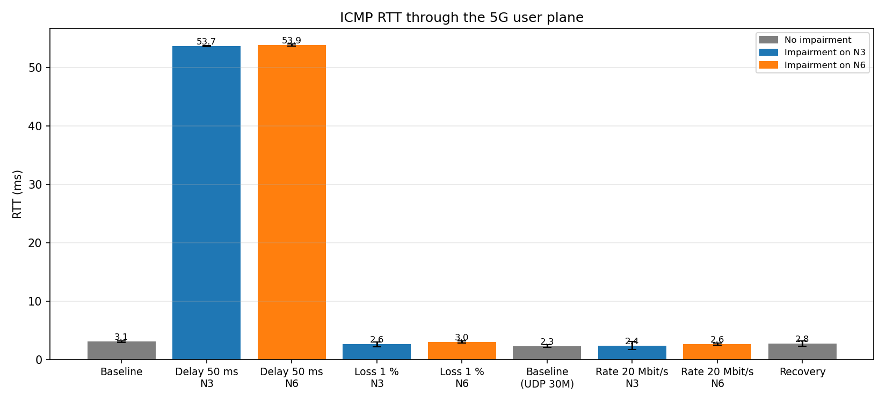
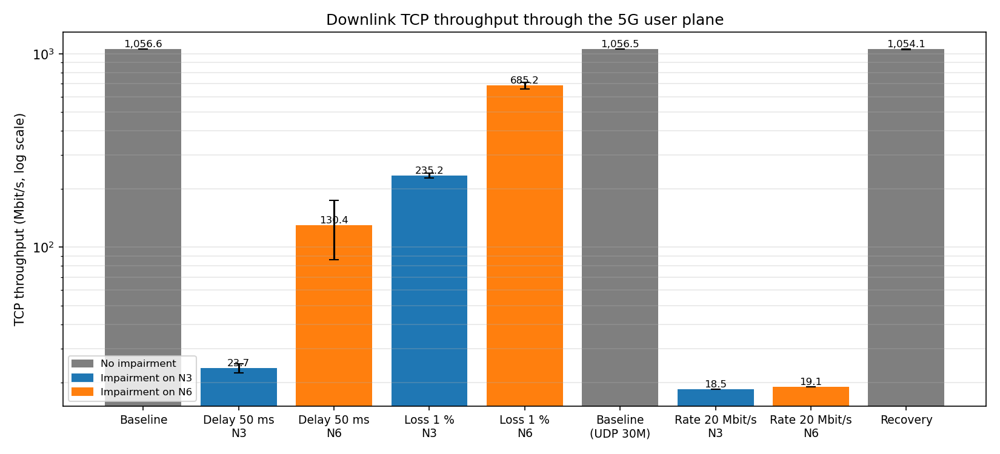
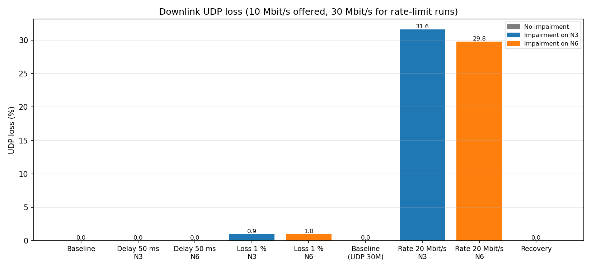
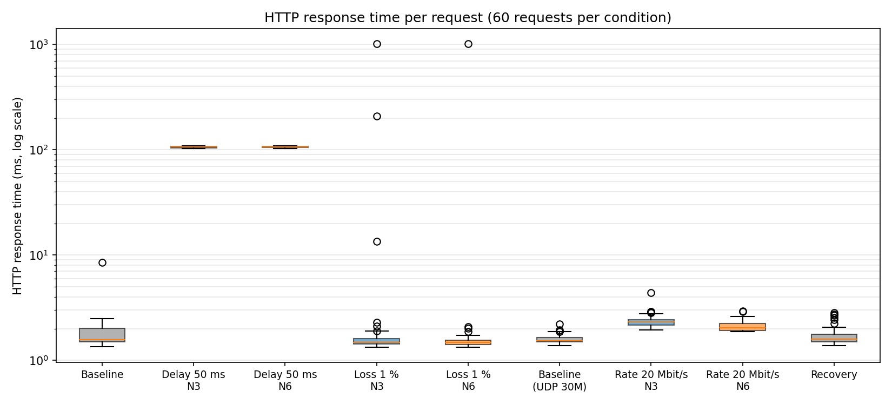
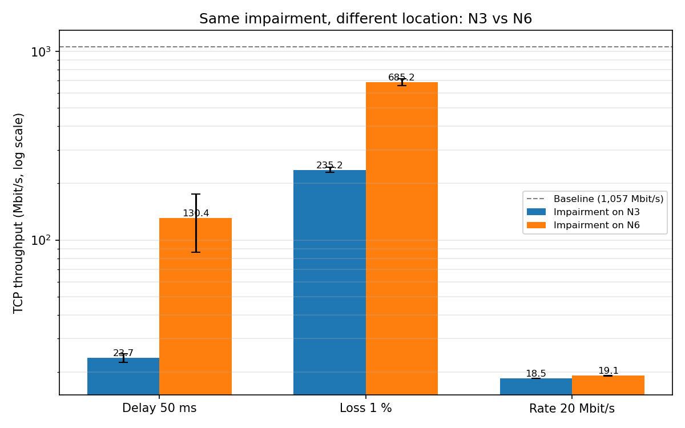

### 4.3 Baseline

- **RTT ~3 ms** through the full 5G path, about 20 times the 0.14 ms of the namespace chain in Scenario A: every packet is encapsulated and decapsulated in user space (UERANSIM gNB, Open5GS UPF).
- **TCP ~1.06 Gbit/s downlink**, stable to within 0.1 % across repetitions. This is the real capacity of the software user plane, unlike the 45 Gbit/s memory-copy figure of Scenario A.
- **~1,100–1,400 TCP retransmissions per 10 s test without any impairment.** TCP probes up to the capacity of the user-space path and overflows its buffers; this background loss must be kept in mind when interpreting the loss experiment.
- UDP 10 and 30 Mbit/s: no loss, jitter below 0.1 ms. HTTP: 100 % success, median 1.6 ms.
- The final **recovery** run reproduces the baseline (1,054 Mbit/s, 2.8 ms, 1.7 ms HTTP): no impairment left a lasting effect.

### 4.4 Experiment 1 — Delay +50 ms

Configured delay → RTT → transport → application:

- **RTT: +50.6 ms (N3) / +50.8 ms (N6).** The delay is applied in one direction (downlink) only, so it is added once per round trip.
- **TCP collapses** (24 Mbit/s on N3, 130 Mbit/s on N6, from 1,057). With a 54 ms RTT, the congestion window must hold ~7 MB in flight to sustain 1 Gbit/s; TCP grows it one round trip at a time and every loss event costs a full recovery at 54 ms. Retransmissions fall (~370 vs ~1,400), presumably because the user-space path is no longer pushed to saturation.
- **UDP is unaffected** (10 Mbit/s delivered, no loss, unchanged jitter): a constant delay shifts datagrams in time but neither drops them nor slows a fixed-rate sender.
- **HTTP: 1.6 → 106 ms, i.e. +104 ms = 2 × 52 ms.** The median TCP connection time rises from 0.9 ms to 52.7 ms (one round trip: SYN → SYN-ACK), and the request/response needs a second round trip. Each round trip crosses the delayed downlink once. Success stays at 100 %.

### 4.5 Experiment 2 — Packet loss 1 %

- **UDP:** 0.95 % (N3) and 0.97 % (N6) receiver-side loss, matching the configured 1 %, with unchanged jitter. Lost datagrams are simply missing: UDP has no acknowledgement or retransmission mechanism.
- **TCP:** the same 1 % of downlink packets triggers duplicate ACKs, fast retransmissions and congestion-window reductions: retransmissions rise to 2,202 (N3) / 5,904 (N6), and throughput drops to 235 / 685 Mbit/s. TCP delivers every byte, at the cost of throughput (packet-level evidence in §4.9).
- **ICMP** (50 pings per repetition) shows a single lost ping in 300 (both locations combined): too small a sample to measure a 1 % loss; the 2,000+ UDP datagrams per test are the reliable estimate.
- **HTTP:** median unchanged (1.5 ms), but the mean rises to 18–22 ms because of three isolated slow requests whose durations sit exactly on TCP timer values:

| Request | Total | TCP connect | Interpretation |
|---|---|---|---|
| loss N3, rep. 1, req. 6 | 1,016 ms | 1,010 ms | SYN-ACK lost → client retransmits its SYN after the **1 s** initial timeout |
| loss N6, rep. 3, req. 12 | 1,013 ms | 1,007 ms | same |
| loss N3, rep. 2, req. 20 | 210 ms | 1 ms | data segment lost after connection → retransmission after the **200 ms** minimum RTO |

Only the SYN-ACK (downlink) can be the lost packet, since both impairments act on the downlink. The median, not the mean, describes the typical request here; the tail describes the cost of a loss.

### 4.6 Experiment 3 — Rate limit 20 Mbit/s

- **TCP: 18.49 Mbit/s (N3) and 19.06 Mbit/s (N6), identical in every repetition, no retransmission.** Below the configured 20 Mbit/s because NetEm limits frame bytes while iperf3 counts TCP payload:
  - N3: 1,348 payload bytes per ~1,450-byte frame (outer Ethernet, IP, UDP, GTP-U headers around the 1,400-byte inner packet) → 20 × 0.93 ≈ 18.6 Mbit/s;
  - N6: 1,448 payload bytes per 1,514-byte frame → 20 × 0.956 ≈ 19.1 Mbit/s.

  The difference between the two locations is the GTP-U encapsulation overhead plus the smaller tunnel MTU. As the assignment points out, a throughput below the configured rate is not a configuration error.
- **UDP offered at 30 Mbit/s: 31.6 % (N3) / 29.8 % (N6) loss, identical to the datagram in every repetition.** The limiter's queue overflows deterministically. Jitter rises from 0.03 to 0.15 ms because of queueing at the limiter. The derived delivered rate (20.5 / 21.1 Mbit/s) is slightly above the limit: when the sender stops, the up to 1,000 packets still queued in NetEm are delivered after the end of the 10 s interval.
- **RTT and HTTP almost unchanged** (2.4 ms, 2.1–2.4 ms): pings and HTTP requests run alone, never concurrently with the bulk tests, so they do not wait behind a full queue.
- Other factors that bound these figures: TCP congestion control (window growth at each round trip), packet size and MTU, the 10 s measurement interval, Docker networking (veth and bridge), Linux scheduling and the WSL2 virtual machine shared by all components (§7).

### 4.7 Experiment 4 — N3 versus N6

N3 (gNB ↔ UPF) carries encapsulated per-packet GTP-U; N6 (UPF ↔ data network) carries the server's plain IP traffic, NAT-ed to the UPF address. The same impairment at the two locations gives:

| Metric | Delay 50 ms N3 / N6 | Loss 1 % N3 / N6 | Rate 20 Mbit/s N3 / N6 |
|---|---|---|---|
| RTT (ms) | 53.7 / 53.9 | 2.6 / 3.0 | 2.4 / 2.7 |
| TCP (Mbit/s) | **23.7 / 130.4** | **235 / 685** | 18.5 / 19.1 |
| TCP retransmissions | 360 / 382 | 2,202 / 5,904 | 0 / 0 |
| UDP loss (%) | 0 / 0 | 0.95 / 0.97 | 31.6 / 29.8 |
| HTTP median (ms) | 106.0 / 107.1 | 1.49 / 1.48 | 2.33 / 2.05 |
| HTTP success | 100 % / 100 % | 100 % / 100 % | 100 % / 100 % |

**The location does change the behaviour, but only for TCP throughput under delay and loss.** RTT, UDP loss and jitter, HTTP latency and availability are the same at both locations. Under rate limitation, the only difference is the encapsulation overhead (§4.6).

What the evidence establishes about the difference:

- **The same NetEm parameter acts on different units.** On N6, the server's TCP stack sends aggregated frames (segmentation offload): the N6 capture shows frames of 2.7 to 42 KB, e.g. a single 42,142-byte frame carrying 42,076 bytes of TCP payload ([screenshot](evidence/wireshark-n6-aggregated-frames.png)). On N3, the UPF emits individual GTP-U packets of ~1,450 bytes. "1 % loss" thus drops one aggregated block of several segments on N6, versus single segments on N3. N6 therefore loses more segments per event (5,904 vs 2,202 retransmissions) but suffers fewer loss events, and TCP reduces its window per event, not per segment: higher throughput (685 vs 235 Mbit/s).
- **The N3 classification structure is not the cause** (control experiment, §4.1: 1.00 vs 1.05 Gbit/s, no drops).
- **NetEm does not drop packets under the 50 ms delay at either location** (`dropped 0` on both, verified with a dedicated 10 s test). On N3, only ~105 packets are in the delay queue at 22 Mbit/s, far below its 1,000-packet limit.

**Open question.** Why TCP stays at ~22–24 Mbit/s with the delay on N3, while NetEm drops nothing there, is not explained. Three hypotheses were tested and rejected: NetEm queue overflow on N3, aggregation measured through the NetEm counters (invalid, because Linux counts each segment of an aggregated frame separately), and an artefact of the N3 filtering structure. The retransmissions observed on N3 (~360 per test) must come from losses elsewhere on the path, most likely in the user-space processing of the UPF or the simulated gNB. Locating them would require per-stage drop counters (UPF TUN interface, gNB and UE socket buffers) during an N3 and an N6 test.

### 4.8 Experiment 5 — Network condition to application impact

| Impairment | Network | Transport | Application |
|---|---|---|---|
| Delay 50 ms | RTT +50 ms | handshake takes one delayed round trip (connect 0.9 → 52.7 ms); throughput limited by window growth | HTTP +104 ms (two round trips), 100 % success |
| Loss 1 % | ~1 % of downlink packets lost | duplicate ACKs, fast retransmission, rare timeouts | median unchanged; rare 210 ms / 1 s requests on TCP timer values; 100 % success |
| Rate 20 Mbit/s | none for isolated packets | bulk TCP capped at 18.5–19 Mbit/s without loss | HTTP +0.5 to 0.8 ms, 100 % success |

The service stayed available (60/60 requests) under every condition: the impairments degrade latency and throughput, not reachability. Delay is the impairment that the application feels most directly; loss is mostly hidden by TCP, except in the tail.

### 4.9 Packet-level evidence — loss on N3 seen from N3 and N6

A 3 s downlink TCP test was run with 1 % loss on N3 while capturing **both** N3 (`udp port 2152`) and N6 (`tcp port 5201`) on the bridge (headers only, 113,057 packets; [`results/capture-n3-n6-loss1pct.pcap`](results/capture-n3-n6-loss1pct.pcap)). iperf3 reported 222 Mbit/s and 663 retransmissions in 3 s.

**1. Inside the N3 tunnel, the UE signals the gap** (Wireshark filter `gtp && tcp.analysis.flags`):

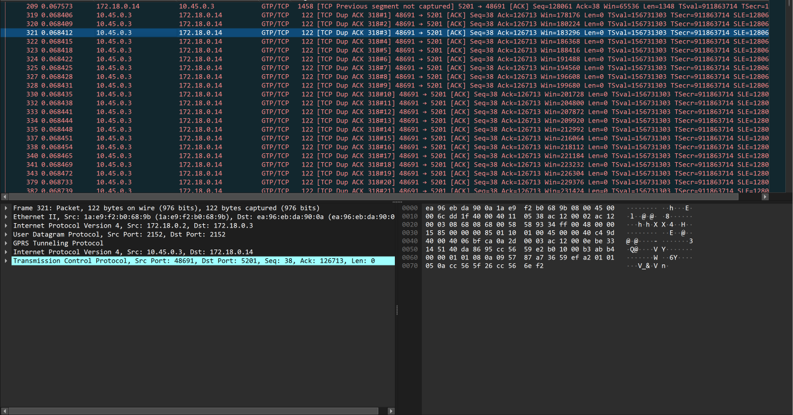

- Packet 209: downlink segment Seq 128061, marked `TCP Previous segment not captured`: segment **Seq 126713** never passed the observation point.
- Packets 319 onwards: the UE sends more than 21 **duplicate ACKs** with `Ack=126713` and SACK blocks describing the data received after the hole.
- The packet detail shows the observation-point structure: outer IP gNB → UPF, UDP 2152, GTP-U, inner IP `10.45.0.3 → 172.18.0.14`, TCP. The acknowledgements travel uplink inside the tunnel.

**2. The same segment seen before and after the UPF** (filter `tcp.seq == 126713 && tcp.len > 0`):

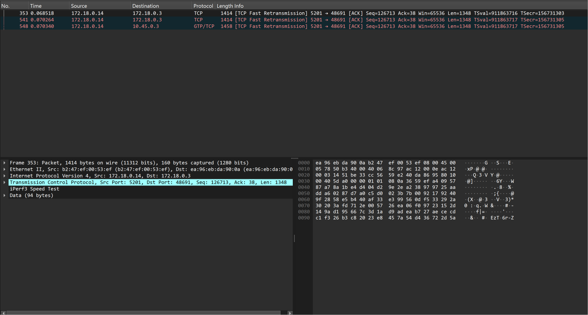

| Transmission | N6 (before the UPF, plain TCP) | N3 (after the UPF, GTP-U) |
|---|---|---|
| Original | present, inside aggregated frame 194 (Seq 110537, 42,076 bytes) | **absent** (`Previous segment not captured`) |
| 1st fast retransmission | present (packet 353, 68.518 ms) | **absent** |
| 2nd fast retransmission | present (packet 541, 70.264 ms) | present (packet 548, 70.340 ms), delivered |

The segment was lost twice, both times between N6 and N3, i.e. at the UPF egress where the impairment is configured. This links the configured condition (1 % loss on N3) to the packet behaviour (missing segments, duplicate ACKs with SACK, fast retransmissions), the transport behaviour (663 retransmissions in 3 s) and the measured impact (222 Mbit/s instead of 1,057). The N6 capture also has to be read differently from N3: no GTP-U, source NAT-ed to the UPF, and aggregated frames ([screenshot](evidence/wireshark-n6-aggregated-frames.png)).

For UDP, the receiver-side loss and jitter reported by iperf3 constitute the evidence (accepted by the assignment); the deterministic loss under the rate limit (§4.6) is consistent with queue overflow.

### 4.10 Prometheus and Grafana

Prometheus is used only as a time-series system, never as a traffic path:

```
Open5GS AMF / SMF / UPF / PCF  (:9090/metrics) ─┐
measure.py, impair.sh → Pushgateway (:9091)    ├─→ Prometheus (scrape every 5 s) ─→ Grafana (:3000)
cAdvisor (host-level counters)                  ─┘
```

Configuration: [`monitoring.yaml`](monitoring.yaml), [`monitoring/prometheus.yml`](monitoring/prometheus.yml), provisioned datasource and dashboard in [`monitoring/grafana/provisioning/`](monitoring/grafana/provisioning/).

| Panel | Source | Required panel |
|---|---|---|
| Configured impairment | `impairment_*` (impair.sh → Pushgateway) | network condition (time reference) |
| RTT | `measure_rtt_avg_ms` | RTT / latency |
| Downlink TCP throughput | `measure_tcp_mbps` | throughput |
| Packet loss (UDP, ICMP) | `measure_udp_loss_pct`, `measure_icmp_loss_pct` | packet loss |
| TCP retransmissions | `measure_tcp_retransmits` | TCP retransmissions |
| HTTP response time | `measure_http_time_ms` | application response time |
| UE / PDU session state | AMF `gnb`, `ran_ue`, `amf_session`; SMF `ues_active`, `bearers_active`, `pfcp_peers_active`; UPF `fivegs_upffunction_upf_sessionnbr` | UE / PDU-session state |
| Registration and PDU session procedures | `increase()` of AMF registration and UPF N4 establishment counters | (control-plane events) |
| VM CPU usage | cAdvisor, root cgroup | system / resource metric |

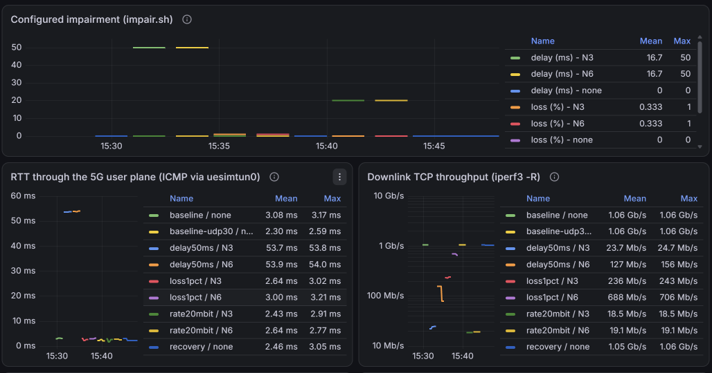
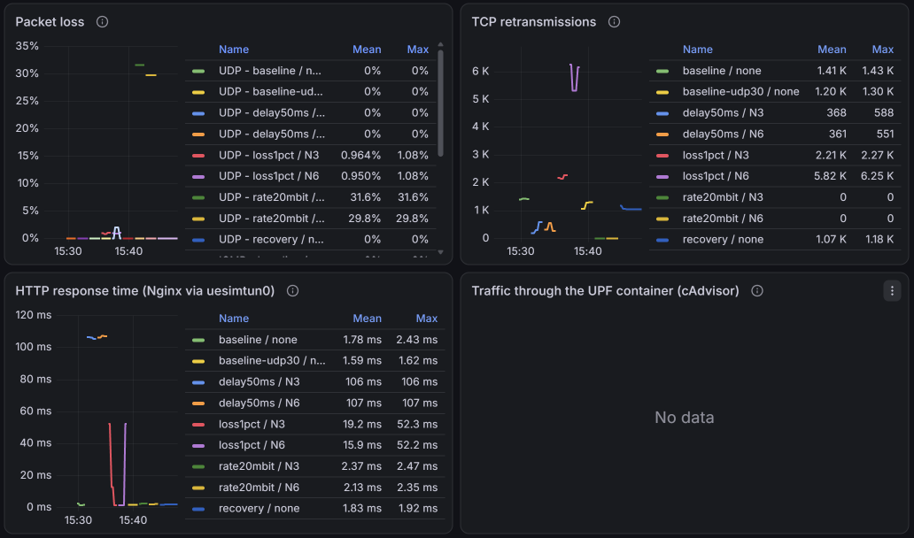
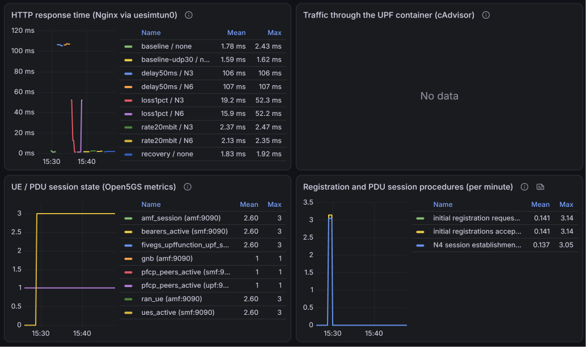

The screenshots are in the browser's time zone (UTC+3): the campaign runs from 15:28 to 15:46 on them, i.e. 12:28–12:46 UTC. They were taken before the cAdvisor panel was replaced (it shows "No data", see limitations); the dashboard file in the repository is the corrected, UTC version.

Reading the dashboard:

- Each impairment window in the top panel coincides with the change in the measurement panels below, and every metric returns to its baseline after the window: degradation and recovery are visible on one timeline.
- **The UE / PDU session panel provides system-level evidence of the failure in §5.2**: before 12:28 UTC, AMF and SMF count **0** connected UEs, sessions and bearers, while the UE container still showed `uesimtun0` up. At 12:28, they jump to 3, and the procedure panel shows the matching spike of 3 initial registrations and 3 N4 session establishments: the automatic UE restart of the pre-flight, seen from the core.

---

## 5. Diagnosed failures (evidence chains)

### 5.1 MongoDB without restart policy

See §2.4: after a WSL restart, UDR and PCF looped on `Failed to connect to server [mongodb://mongo/open5gs]` because MongoDB was the only service without `restart: on-failure`. A related, self-healing variant at every startup (UDR and PCF registering ~98 s after the other NFs, `No NF-Instance [nudr-dr:UDM]` in the meantime) is analysed in §3.7.

### 5.2 Recurrent radio link failures caused by WSL2 clock steps

| Element | Evidence |
|---|---|
| **Symptom** | During the first Step 3 attempt (6 October), pings through `uesimtun0` lost 100 %, iperf3 could not connect, and the NetEm counter on N3 stayed at 0 packets. The failure persisted after the impairment was removed. |
| **Misleading state** | `uesimtun0` remained `UP` with its address, and every container was `Up`: interface and container state are not path evidence. |
| **Affected component** | The simulated radio link between UE and gNB. UE log: `Signal lost for cell[1]`, `Radio link failure detected`, then `PLMN selection failure, no cells in coverage`; gNB log: `UE[1] signal lost`. N2 and the core were healthy (gNB never restarted, no AMF error). |
| **Why it does not recover** | After the failure, the UE goes idle and, at the next data packet, sends a Service Request with a new RRC Setup Request. The gNB still holds the old UE context and answers `Discarding RRC Setup Request, UE context already exists` (12 occurrences); the UE abandons after `NAS timer[3517] expired`. Only a UE restart (new contexts, old ones released by the AMF through `UE Context Release Command`) restores the user plane. |
| **Frequency** | 20 signal-loss events in 90 minutes, every 1 to 15 minutes, including while nothing was running; all UEs lost at the same millisecond on both sides, the cell "re-detected" within the same millisecond. |
| **False suspect eliminated** | The N3 impairment: first applied at 11:10:10 UTC, 61 s after the first failure (11:09:09 UTC), as shown by `impairments.log`. |
| **Root-cause evidence** | `clock_monitor.py` (wall clock vs monotonic clock every 0.2 s) recorded a forward wall-clock step of **+1.10 to +1.25 s every ~33.4 s**. Each radio link failure coincides with a step: 12:51:23.963 / 12:51:23.971, 12:52:30.846 / 12:52:30.920, 12:53:37.824 / 12:53:37.696 (UE log / monitor), within the monitor's 0.2 s resolution. |
| **Root cause** | `systemd-timesyncd` was active with its poll interval stuck at the 32 s minimum (`PollIntervalUSec=32s`). The VM clock drifted by ~1.15 s per 32 s cycle (~3.4 %); above 0.4 s of offset, timesyncd steps the clock instead of slewing it. UERANSIM's radio-link heartbeat timing most likely follows the wall clock (the systematic coincidence of failures with steps indicates it), so a 1.15 s step looks like more than a second without heartbeats for every UE at once. Whether a given step triggers a failure depends on its phase relative to the heartbeat, which is why not every step did. |
| **Measured impact** | User plane completely down until the UE restart; measurements taken in this state are invalid (the first attempt was discarded). |
| **Correction** | During measurements: `systemd-timesyncd` stopped (no steps; the clock drifts by a few seconds over 20 minutes, identically for every container, Prometheus and the dataset), clock monitor running as proof, automatic UE recovery in `measure.py`. Result: zero clock jumps and zero radio link failures during the campaign. Switching the kernel clock source from `tsc` to `hyperv_clocksource_tsc_page` was also tried; its effect was inconclusive (the drift was already smaller that day, 133–186 ms per cycle, below the step threshold). |
| **Recovery seen from the core** | Grafana UE / PDU session panel: 0 → 3 UEs and sessions at 12:28 UTC, with 3 registrations and 3 N4 establishments (§4.10). |

---

## 6. Observation methods: purpose and limitations

| Method | Purpose in this project | Limitations met |
|---|---|---|
| `tcpdump` / Wireshark on the Docker bridge | protocol behaviour per interface (N2, N3, N4, N6), encapsulation, location of a loss by comparing observation points, retransmissions and duplicate ACKs | sees only inter-container traffic; N6 frames are aggregated (one frame ≠ one segment); headers only to keep files small; cannot see inside UERANSIM's simulated radio link; large volumes at 1 Gbit/s |
| Network-function logs (Open5GS, UERANSIM) | procedures and state transitions (registration, PDU session, NRF discovery), failure causes (RLF, discarded RRC Setup, MongoDB) | container time in UTC, host in UTC+2; verbose; no packet timing; the UE log does not mark the tunnel as dead after an RLF |
| Active measurements (`ping`, `iperf3`, `curl` in `measure.py`) | quantitative end-to-end performance at the network, transport and application levels | short tests on a shared VM; must be bound to `uesimtun0`; iperf3 reverse-mode UDP field mismatch (§4.2); ICMP samples too small for 1 % loss |
| Prometheus + Grafana | temporal correlation between condition, measurements and 5G state; NF counters | 5 s resolution; Pushgateway series are step functions (last value); cAdvisor cannot identify containers here; UPF N3 packet counters (`fivegs_ep_n3_gtp_*`) stay at 0 despite traffic, so they are not used |
| `docker compose ps`, interface state | process and interface state only | proves nothing about N2/N3/N4/N6 operation (§5.2) |
| `clock_monitor.py` | integrity of the host time base | detects only steps above 0.5 s |

---

## 7. Known limitations

- **Single Docker bridge.** N3, N4 and N6 share the UPF's `eth0`; N3 impairments are therefore scoped with a port filter, and N6 impairments are applied on the server containers. Both act on the downlink only.
- **Dynamic container addresses.** IPs change across restarts; filters use ports, and the IPs quoted in this report are those of the respective capture.
- **WSL2 clock.** Clock steps break UERANSIM's radio link (§5.2). Measurements require `systemd-timesyncd` to be stopped; `run_campaign.sh` does this and restores it at the end.
- **UERANSIM recovery.** After a radio link failure, the UE stays detached until restarted; `measure.py` handles it automatically.
- **Shared VM.** All network functions, the simulated RAN, the measurement tools and Prometheus share the same CPUs; absolute throughputs reflect the user-space processing capacity of this machine.
- **cAdvisor.** Only root-cgroup counters are exported in this WSL2/Docker setup; per-container CPU and network metrics are unavailable, so the dashboard shows VM-level CPU.
- **Sample size.** 3 repetitions per condition; the delay-on-N6 TCP result shows a large spread (156, 156, 79 Mbit/s).
- **Open question.** The low TCP throughput under delay on N3 is not fully explained (§4.7).

---

## 8. Conclusion

A complete 5G SA network (Open5GS core, UERANSIM gNB and UEs, Nginx and iperf3 on N6) was deployed and verified end to end. Its control-plane procedures (registration, authentication, PDU session, NRF/SCP service interactions) and user-plane transport (N2/SCTP, N4/PFCP, N3/GTP-U, N6) were observed with logs and packet captures. A reproducible measurement campaign then quantified the baseline and the effect of delay, loss and rate limitation at two locations, with a structured dataset analysed in Python, a Grafana dashboard correlating conditions, measurements and 5G state, and packet-level evidence of a loss located at the UPF. Two failures were diagnosed through complete evidence chains, the main one tracing a radio-link failure back to clock steps of the WSL2 virtual machine.

Main findings: delay is what the application feels most (HTTP +104 ms for +50 ms of one-way delay); TCP hides 1 % loss from the application except in rare timer-bound requests, while UDP simply loses the datagrams; a rate limit costs less than the configured rate because of protocol overhead, more on N3 because of GTP-U; and the same impairment hurts TCP much more on N3 than on N6, partly because NetEm acts on individual GTP-U packets on N3 and on aggregated frames on N6.

---

## Appendix — Reproducing the environment and the measurements

All commands from this directory. The compose files must share one project name (the scripts address containers by name):

```bash
export COMPOSE_PROJECT_NAME=open5gs-and-ueransim
sudo modprobe sctp                                  # N2 uses SCTP

docker compose -f ngc.yaml up -d                    # 5G core
./register_subscriber.sh                            # subscribers in MongoDB
docker compose -f gnb1.yaml up -d                   # gNB + 3 UEs
docker compose -f app.yaml up -d                    # Nginx + iperf3 (N6)
docker compose -f monitoring.yaml up -d             # Prometheus, Pushgateway, cAdvisor, Grafana
```

Verification (always through the tunnel):

```bash
docker exec open5gs-and-ueransim-ues1-1 ip -4 addr show uesimtun0
docker exec open5gs-and-ueransim-ues1-1 ping -I uesimtun0 -c 4 nginx
docker exec open5gs-and-ueransim-ues1-1 curl -s -o /dev/null -w "%{http_code}\n" --interface uesimtun0 http://nginx
```

Campaign and analysis:

```bash
cd scripts
./run_campaign.sh 2>&1 | tee ../results/campaign.log    # ~20 min, needs sudo
python3 analyze.py                                      # summary + figures
```

Grafana: http://localhost:3000 (admin / admin), dashboard "Step 3 - 5G user-plane measurement campaign".
