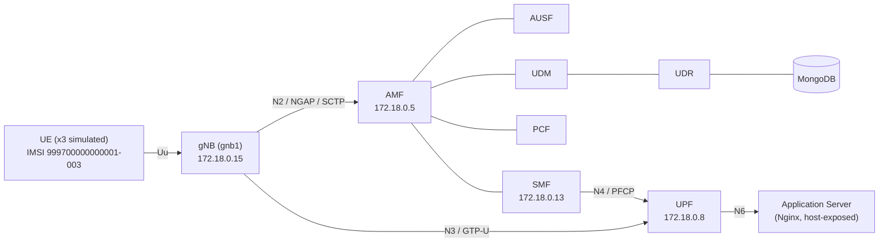

# Project 1 – Network Deployment, Measurement, and Observability
## Technical Report — Scenario B (Advanced 5G SA Network)

**Author:** Damien Guffon — Esisar
**Environment:** WSL2 (Ubuntu 24.04.2 LTS), Docker Compose, base deployment from [Gradiant/openverso-images](https://github.com/Gradiant/openverso-images)

**Status:** Step 1 complete. Step 2 partially complete (N2/NGAP/SCTP, N3/GTP-U, N4/PFCP documented with log + packet evidence; N6/application traffic and service-based-architecture analysis still pending). Step 3 not started.

---

## 1. Overview

Scenario B deploys a full 5G Standalone (SA) core and RAN using Open5GS and UERANSIM in Docker, following the reference path:

```
UE → gNB → N3/GTP-U → UPF → N6 → Data Network → Application Service
```

with the parallel control-plane path:

```
gNB → N2/NGAP/SCTP → AMF → SMF → N4/PFCP → UPF
```

**PLMN / identifiers:** MCC `999`, MNC `70`, TAC `1`, SST `1`, SD `0xffffff`

**Deployment choice:** unlike the course reference diagram (which uses separate subnets per domain, e.g. `10.20.x.x`), this deployment places the gNB, UEs, all 13 core network functions, and the application server on a **single Docker bridge network** (`open5gs-and-ueransim_default`, `172.18.0.0/16`). This is a deliberate simplification inherited from the Gradiant reference base and is explicitly permitted by the assignment ("*you may use alternative software or technical approaches*"). It does not affect the validity of the 5G procedures themselves — registration, authentication, and PDU session establishment all occur exactly as they would with segmented subnets.

### Architecture



---

## 2. Step 1 — Network Deployment and End-to-End Operation

### 2.1 Network functions deployed

Via `ngc.yaml` (13 containers): AMF, AUSF, BSF, MongoDB, NRF, NSSF, PCF, SCP, SMF, UDM, UDR, UPF, WebUI.
Via `gnb1.yaml`: gNB (`gnb1`) + 3 simulated UEs (`ues1`).

### 2.2 Interface table

| Interface | Role | Protocol | Between |
|---|---|---|---|
| N2 | RAN control signaling | NGAP / SCTP | gNB ↔ AMF |
| N3 | User-plane transport | GTP-U / UDP (port 2152) | gNB ↔ UPF |
| N4 | Session control | PFCP / UDP (port 8805) | SMF ↔ UPF |
| N6 | Data network connectivity | IP (NAT) | UPF ↔ Internet / App |
| SBI | Service bus | HTTP/2 | AMF/SMF/AUSF/UDM/UDR/PCF/NRF/SCP ↔ each other |

**UE IP pool:** `10.45.0.0/16`, gateway `10.45.0.1` (defined in `config/smf.yaml`)

### 2.3 Proof of end-to-end operation

```
# UE side: PDU session established, TUN interface up
uesimtun0: inet 10.45.0.2/32 scope global uesimtun0

# Connectivity to the internet (N6)
$ ping -I uesimtun0 -c 4 8.8.8.8
4 packets transmitted, 4 received, 0% packet loss
rtt min/avg/max/mdev = 58.796/70.422/91.143/12.432 ms

# Connectivity to the application server, through the 5G path (not a Docker shortcut)
$ curl http://<host-ip>:8080
<!DOCTYPE html><title>Welcome to nginx!</title>...
```

The curl test was deliberately run against an **IP outside the Docker bridge subnet** (the WSL host's own address), forcing the response to route back through `uesimtun0` rather than a direct container-to-container hop on `eth0`. This matches the assignment's explicit warning: *"N6 connectivity is not proof of 5G user-plane connectivity... UE → Nginx tests the complete 5G user-plane path."*

### 2.4 Diagnosed incident — service dependency without restart policy

After ~3 days of WSL inactivity, `udr` and `pcf` were found in a continuous restart loop.

- **Symptom:** `docker compose ps` showed `udr`/`pcf` as `Restarting (1)`.
- **Evidence:** logs showed `Failed to connect to server [mongodb://mongo/open5gs]` repeating every ~60s.
- **Root cause:** in `ngc.yaml`, `mongo` was the only service without a `restart: on-failure` policy. After the WSL restart, every other service recovered automatically; `mongo` stayed stopped, so every service depending on it (`udr`, `pcf`) failed to initialize in a loop. `gnb1`/`ues1` had the same gap and had also stopped.
- **Fix:** `docker start` on `mongo`, then on `gnb1`/`ues1`; `restart: on-failure` added to all three in `ngc.yaml` / `gnb1.yaml` to prevent recurrence.
- **Verification:** subscriber data in MongoDB confirmed intact after recovery; full registration cycle re-confirmed (new `uesimtun0` IP assigned, ping to 8.8.8.8 successful).

---

## 3. Step 2 — Traffic Observation and 5G Protocol Behavior (partial)

Method: live logs from `amf`, `ausf`, `udm`, `udr`, `smf`, `upf`, `gnb1`, `ues1` captured during a triggered registration cycle (`docker restart` on the UE container), paired with a `tcpdump` packet capture on the Docker bridge interface filtered per-interface (N2/N4 together, N3 separately with a simultaneous ping to generate user-plane traffic).

### 3.1 Registration sequence (UE `imsi-999700000000002` → `uesimtun0`)

| Step | From → To | Interface | Log evidence |
|---|---|---|---|
| PLMN/cell selection | UE | — | `Selected plmn[999/70]`, `Selected cell... tac[1]` |
| RRC Setup | UE → gNB | Uu (simulated) | UE: `Sending RRC Setup Request` / gNB: `RRC Setup for UE[2]` |
| Registration Request | gNB → AMF | **N2/NGAP/SCTP** | AMF: `InitialUEMessage`, `Unknown UE by SUCI` |
| AUSF selection | AMF → AUSF | SBI | AMF: `Setup NF Instance [type:AUSF]` |
| Authentication Request | AMF → UE (via N2) | N2 | UE: `Authentication Request received` |
| Security Mode Command | AMF → UE (via N2) | N2 | UE: `Security Mode Command received` |
| Subscriber data fetch | AMF → UDM → UDR → MongoDB | SBI | UDR: `MongoDB URI: mongodb://mongo/open5gs` |
| Policy association | AMF → PCF | SBI | AMF: `Setup NF EndPoint... npcf-handler` |
| Registration Accept/Complete | AMF ↔ UE | N2 | UE: `Initial Registration is successful` |
| PDU Session Establishment Request | UE → AMF → SMF | N2 then SBI | AMF: `/nsmf-pdusession/.../modify` |
| PDU Session Establishment Accept | SMF → AMF → UE | N2 | UE: `PDU Session establishment is successful PSI[1]` |
| Tunnel up | — | — | UE: `TUN interface[uesimtun0, 10.45.0.2] is up` |
| N3 resource setup | gNB ↔ UPF | N3 | gNB: `PDU session resource(s) setup for UE[2] count[1]` |

Full raw log: [`evidence/registration-sequence-full.log`](evidence/registration-sequence-full.log)

### 3.2 N2 / NGAP / SCTP analysis

Packet capture ([`evidence/n2-n3-n4-summary.txt`](evidence/n2-n3-n4-summary.txt)) shows the SCTP association between gNB (`172.18.0.15:38559`) and AMF (`172.18.0.5:38412`) already alive and periodically probed via `[HB REQ]/[HB ACK]` heartbeats **before** any UE activity — proof that N2 is a persistent control-plane association, independent of individual UE sessions. Actual `[DATA]` chunks begin at the exact timestamp the AMF log records `InitialUEMessage`, confirming that the NGAP Registration Request is carried inside this SCTP association. Multiple Stream IDs (`SID: 1, 2, 3, 7, 8, 9...`) are used concurrently — SCTP's multi-streaming, which lets the 3 parallel UE registrations proceed without head-of-line blocking (the reason NGAP uses SCTP rather than TCP).

### 3.3 N4 / PFCP analysis

For `imsi-999700000000003` (assigned `10.45.0.20`):

| Level | Evidence |
|---|---|
| SMF log | `UE SUPI[imsi-...003] DNN[internet] IPv4[10.45.0.20]` |
| UPF log | `UE F-SEID[UP:0x99e CP:0xafd]... IPv4[10.45.0.20]` (same timestamp, same IP) |
| Packet | `172.18.0.13.8805 > 172.18.0.8.8805: UDP, length 596` (PFCP Session Establishment Request) then `172.18.0.8.8805 > 172.18.0.13.8805: UDP, length 116` (Response), followed by a smaller Modification exchange (75/21 bytes) |

Three such exchanges appear in the capture, one per registered UE. This confirms N4/PFCP does not carry application data — it only configures the UPF's forwarding/session state, which is then used to actually forward N3 user-plane traffic.

### 3.4 N3 / GTP-U analysis

A dedicated capture was taken on UDP port 2152 while simultaneously pinging `8.8.8.8` from inside the UE (`ping -I uesimtun0`). Result: 10 packets (5 request + 5 reply), perfectly matching the 5 ICMP exchanges — text summary in [`evidence/n3-summary.txt`](evidence/n3-summary.txt).

Opened in Wireshark, a single packet decodes as:


```
Ethernet
 └─ IP        172.18.0.15 (gNB) → 172.18.0.8 (UPF)      ← outer envelope (N3 transport)
     └─ UDP   port 2152
         └─ GTP-U (GPRS Tunneling Protocol)
             └─ IP    10.45.0.20 (UE) → 8.8.8.8          ← inner packet, the UE's own traffic
                 └─ ICMP
```

This is the direct evidence requested by the assignment for *"why the inner application packet can be carried inside GTP-U"*: on the transport network between gNB and UPF, only generic UDP traffic between two Docker hosts is visible — the UE's real source/destination IP is completely hidden unless the GTP-U layer is decoded. Wireshark also auto-correlates request/reply pairs (`reply in 2`) and shows differing TTLs (64 outbound from the UE, 104 on the reply from the public internet), consistent with every other RTT measurement taken so far.

### 3.5 Remaining for Step 2

- **N6 / application traffic (TCP, UDP):** not yet captured through the 5G path specifically. Nginx currently runs as a standalone `docker run` container (not yet integrated into a compose file), and iperf3 has not yet been added. Needed: TCP test (UE → Nginx) and UDP test (UE → iperf3), each with packet capture, run through `uesimtun0`.
- **Service-based architecture analysis (NRF/SCP/AMF/SMF/AUSF/UDM/UDR/PCF):** NF discovery and service calls are visible in the logs already collected (e.g. `Setup NF Instance`, `NRF-notify`) but have not yet been explicitly written up as a dedicated SBI analysis section.

---

## 4. Step 3 — Performance Measurement, Network Degradation, and Data-Driven Analysis

**Not started.** Will require: a quantitative baseline over the full UE→gNB→N3→UPF→N6→App path (≥3 repetitions per metric), controlled degradation experiments (delay, loss, rate limiting, applied at different points), Prometheus + Grafana for time-series/operational telemetry, and a Python/pandas/matplotlib-based analysis — all explicitly required for Scenario B but not for Scenario A.

---

## Appendix — Redeploying this environment

```bash
docker compose -f ngc.yaml up -d
./register_subscriber.sh
docker compose -f gnb1.yaml up -d
```

Verify end-to-end operation:
```bash
docker compose -f gnb1.yaml exec ues1 ip addr show
docker compose -f gnb1.yaml exec ues1 ping -I uesimtun0 -c 4 8.8.8.8
```
